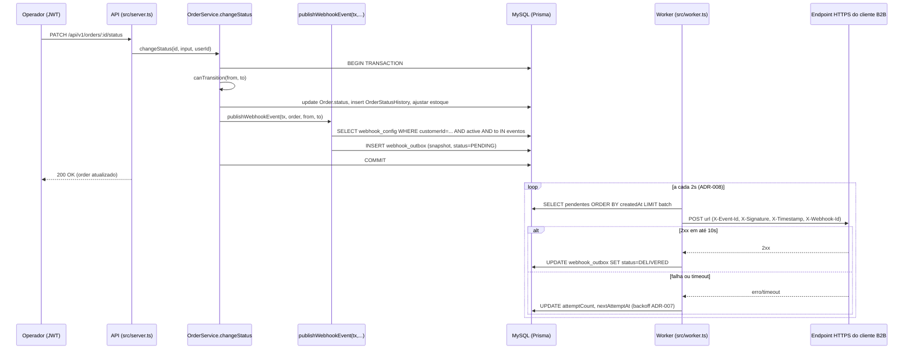

### FDD: Sistema de Webhooks de Notificação de Pedidos (Order Webhooks Notification System)

Versão: 1.0
Data: 2026-09-11
Responsável: Larissa (Tech Lead), autora e condutora do documento de design conforme intenção declarada em `[09:50]` Larissa ("Eu vou abrir o doc de design da feature e marcar uma sessão pro Bruno e o Diego revisarem comigo antes da gente começar a codar")

---

### 1. Contexto e motivação técnica

O OMS (Order Management System) é hoje uma API síncrona de gestão de pedidos B2B, organizada em módulos por domínio (`src/modules/{auth,users,customers,products,orders}`), sem nenhum mecanismo de notificação assíncrona de eventos. A única forma de um consumidor externo saber que o status de um pedido mudou é fazer polling em `GET /orders`. Três clientes B2B (Atlas Comercial, MaxDistribuição e Nova Cargo) formalizaram pedido para serem notificados em tempo real, com a Atlas sinalizando risco de churn até o fim do trimestre (`[09:00]` Marcos). O limite de latência aceito pelos clientes como "tempo real" é qualquer valor abaixo de 10 segundos (`[09:02]` Marcos), e o fluxo é estritamente outbound (a plataforma envia, os clientes apenas recebem, `[09:02]` Sofia/Marcos).

A RFC aprovada (`docs/RFC.md`, seções 2 e 3) já situa esse contexto de negócio e problema técnico: o sistema não possui hoje nenhum ponto de extensão para publicar eventos de domínio de forma assíncrona e confiável, e a única fronteira transacional existente (`OrderService.changeStatus`) não pode se comunicar de forma segura com sistemas externos sem acoplar a disponibilidade desses sistemas à disponibilidade da própria transação de negócio. Este FDD parte dessa visão macro já fechada e detalha exatamente como a feature se encaixa no código real.

O ponto de encaixe técnico é `OrderService.changeStatus` (`src/modules/orders/order.service.ts:126-179`), que hoje já executa, dentro de um único `prisma.$transaction`, a validação da transição (`canTransition`, `src/modules/orders/order.status.ts:12-14`), o débito/reposição de estoque (`shouldDebitStock`/`shouldReplenishStock`, `order.status.ts:29-37`), a atualização de `Order.status` e a inserção de uma linha de auditoria em `OrderStatusHistory` (`order.service.ts:151-167`). A ADR-003 (Publicação Atômica de Eventos de Webhook via Outbox dentro de `OrderService.changeStatus`) e a ADR-006 (Padrão Outbox no MySQL) já confirmam esse ponto de extensão como decisão fechada: a inserção do evento de webhook deve ocorrer dentro dessa mesma transação, via uma função pura `publishWebhookEvent(tx, order, fromStatus, toStatus)`, sem introduzir um `WebhookRepository` completo no `OrderService`. Este FDD não reabre essa escolha; detalha sua implementação exata.

A feature também introduz, pela primeira vez no projeto, uma topologia de dois processos Node coordenados exclusivamente pelo banco de dados compartilhado: o processo HTTP da API (`src/server.ts`, existente) e um novo processo worker (`src/worker.ts`, proposto), conforme ADR-008. Ambos reaproveitam o padrão de `PrismaClient` singleton por processo já confirmado pela ADR-002 (`src/config/database.ts:4-10`) e toda a infraestrutura transversal já estabelecida: hierarquia de erros `AppError` (`src/shared/errors/`), logger Pino (`src/shared/logger/index.ts`), middleware de erro centralizado (`src/middlewares/error.middleware.ts`) e autenticação JWT/RBAC (`src/middlewares/auth.middleware.ts`, ADR-001).

**Atores**: usuários operadores/administradores do OMS (que cadastram e gerenciam webhooks via API autenticada, em nome de um `customer`), administradores (`role ADMIN`, únicos autorizados a reprocessar eventos em DLQ), o processo worker (ator técnico, não humano, responsável pela entrega), e os sistemas HTTP dos três clientes B2B (consumidores externos passivos, apenas recebem).

**Limites de escopo** (detalhados na Seção 3): o fluxo é estritamente outbound; não há webhooks inbound, dashboard visual, notificação por e-mail em caso de falha, ou rate limiting de saída nesta entrega, conforme já fechado na RFC (Seção 5, "Fora do Escopo") e na transcrição.

---

### 2. Objetivos técnicos

- Entregar eventos de mudança de status a clientes B2B com latência de caso comum abaixo de 10 segundos, sendo o pior caso aceito igual ao intervalo de polling do worker (2 segundos), conforme ADR-008 e `[09:09]-[09:10]` Diego/Marcos/Larissa.
- Garantir invariante de consistência forte: para toda transição de status persistida com sucesso, e apenas para transições com pelo menos um webhook interessado, deve existir exatamente um evento correspondente inserido na mesma transação SQL (`prisma.$transaction`); nenhuma transição commitada pode ficar sem evento correspondente, e nenhum evento pode existir sem uma transição efetivamente commitada (ADR-003, ADR-006, `[09:40]-[09:41]` Bruno/Diego).
- Eliminar acoplamento síncrono entre a disponibilidade de sistemas externos de clientes e a capacidade de `OrderService.changeStatus` de processar outras transições de outros pedidos (`[09:04]` Bruno; ADR-003, Alternativas Consideradas).
- Garantir autenticidade e integridade verificável de cada evento entregue via HMAC-SHA256 com secret exclusiva por endpoint cadastrado (ADR-004), com rotação sem downtime (grace period de 24h).
- Garantir entrega at-least-once com deduplicação delegada ao cliente via `X-Event-Id` constante em todas as tentativas de reenvio do mesmo evento (ADR-005).
- Garantir que nenhuma falha de entrega seja descartada silenciosamente: eventos que esgotam as tentativas de retry (5 tentativas, backoff 1m/5m/30m/2h/12h) são movidos para uma DLQ auditável e reprocessável manualmente (ADR-007).
- Reaproveitar 100% dos padrões arquiteturais já estabelecidos no projeto (módulos `*.routes.ts → *.controller.ts → *.service.ts → *.repository.ts` + `*.schemas.ts`, hierarquia `AppError`, logger Pino, middleware de erro centralizado, `PrismaClient`, `authenticate`/`requireRole`), sem introduzir novo mecanismo de logging, autenticação interna ou ORM (`[09:30]` Larissa).

---

### 3. Escopo e exclusões

**Incluído**

- CRUD completo de configuração de webhook (criação, edição, remoção, listagem por `customer`), com secret gerada pela plataforma e devolvida apenas na criação (`[09:31]-[09:33]` Marcos/Bruno).
- Filtragem de interesse por status de pedido no momento da inserção do evento na outbox, evitando inserir eventos para webhooks que não os solicitaram (`[09:33]-[09:34]` Marcos/Bruno/Diego).
- Consulta de histórico de entregas por webhook (`GET /webhooks/:id/deliveries`), incluindo payload, response e tempo de resposta (`[09:34]` Marcos).
- Endpoint administrativo de replay manual de evento em DLQ, restrito a `role ADMIN`, com log de auditoria do usuário responsável (`[09:18]`, `[09:35]-[09:36]` Diego/Sofia/Larissa).
- Rotação de secret via API com grace period de 24h (`[09:21]` Sofia).
- Publicação atômica do evento de webhook dentro da transação de `OrderService.changeStatus` (ADR-003, ADR-006).
- Worker de entrega em processo separado, com polling a cada 2 segundos, autenticação HMAC-SHA256 nas chamadas de saída, retry com backoff exponencial e DLQ (ADR-004, ADR-007, ADR-008).

**Excluído**

- Webhooks inbound (clientes enviando dados para a plataforma); o fluxo é estritamente outbound (`[09:02]` Sofia/Marcos; RFC Seção 5).
- Notificação por e-mail em caso de falhas recorrentes de entrega, explicitamente adiada para fase futura (`[09:37]-[09:38]` Larissa/Marcos; RFC Seção 5).
- Rate limiting de envio de webhooks para clientes com picos de eventos simultâneos; deliberadamente deixado como "observar e decidir depois" (`[09:38]-[09:39]` Diego/Larissa).
- Dashboard visual para o cliente gerenciar seus webhooks; interação somente via API nesta fase (`[09:39]-[09:40]` Larissa/Marcos).
- Endurecimento futuro de RBAC no CRUD de configuração de webhook além da exigência mínima de JWT válido (`[09:36]-[09:37]` Marcos/Sofia).
- Arquivamento/purga de eventos já entregues na outbox após 30 dias (`[09:08]` Diego; RFC Seção 5).
- Suporte a múltiplos workers em paralelo com garantia de ordering global (`[09:12]-[09:13]` Diego/Bruno; ADR-006, ADR-008).
- Mecanismo formal de supervisão/restart do processo worker em caso de crash: reconhecido como necessidade pela equipe, mas sem definição operacional nas fontes (ADR-008, `[PRECISA DE INFORMAÇÃO]`). Este FDD trata esse ponto como lacuna explícita na Seção 7 e na Seção 11, não como item implementado nesta entrega.
- Definição de política de armazenamento da secret em repouso (texto plano, hash, ou KMS) e de fluxo de revogação de emergência durante o grace period: lacunas explícitas da ADR-004, não resolvidas por nenhuma fonte disponível a este FDD.

---

### 4. Fluxos detalhados e diagramas

**Fluxo principal**

- Um usuário autenticado (JWT válido, qualquer role, `authenticate` em `src/middlewares/auth.middleware.ts:27-46`) cadastra um webhook via `POST /api/v1/webhooks`, informando `customerId`, `url` (validada como HTTPS) e a lista de status de interesse; a plataforma gera a secret e a devolve apenas nesta resposta (`[09:31]` Marcos; ADR-004).
- Em algum momento posterior, uma requisição autenticada normal de operação de pedidos aciona `PATCH /api/v1/orders/:id/status` (rota existente, `src/modules/orders/order.routes.ts:19-23`) que chega a `OrderController.changeStatus` (`src/modules/orders/order.controller.ts:38-46`) e daí a `OrderService.changeStatus` (`order.service.ts:126-179`).
- Dentro do mesmo `prisma.$transaction` já existente, após validar a transição (`canTransition`, `order.status.ts:12-14`) e aplicar débito/reposição de estoque e atualização de status/histórico (`order.service.ts:151-167`), o serviço invoca `publishWebhookEvent(tx, order, fromStatus, toStatus)` (ADR-003), que consulta `webhook_config` por `customerId` ativo e com `toStatus` na lista de interesse, e insere uma linha em `webhook_outbox` por configuração correspondente, com o payload já renderizado como snapshot (ADR-006, `[09:51]-[09:52]` Larissa/Diego/Bruno).
- A transação inteira (status, histórico, estoque, outbox) é commitada ou revertida atomicamente; não há caminho em que a mudança de status seja persistida sem o evento correspondente, nem vice-versa (ADR-003, ADR-006).
- O processo worker (`src/worker.ts`, ADR-008), independente do processo da API, lê a outbox em polling, assina e envia o evento via HTTP ao(s) endpoint(s) cadastrado(s), aplicando retry com backoff em caso de falha e movendo para DLQ ao esgotar as tentativas (detalhado nos quatro sub-fluxos abaixo).
- O cliente que integrou o webhook pode consultar o histórico de entregas via `GET /api/v1/webhooks/:id/deliveries`, e um administrador pode reprocessar manualmente um evento em DLQ via `POST /api/v1/admin/webhooks/dead-letter/:id/replay`.

**Diagrama de sequência (fluxo principal)**



**Criação do evento na outbox**

- Ocorre exclusivamente dentro de `OrderService.changeStatus` (`order.service.ts:131-177`), nunca fora de uma transação Prisma (ADR-003, ADR-006).
- Ponto de inserção proposto por este FDD: imediatamente após `await tx.orderStatusHistory.create(...)` (`order.service.ts:159-167`) e antes da consulta de `refreshed` (`order.service.ts:169-176`), via `await publishWebhookEvent(tx, order, from, to)`.
- `publishWebhookEvent` é uma função pura que recebe o `Prisma.TransactionClient` (`tx`) já aberto, o `order` (com `items`), `fromStatus` e `toStatus`; não recebe nem instancia um `WebhookRepository` completo, conforme decisão fechada em `[09:41]` Bruno/Diego e ADR-003.
- A função consulta `webhook_config` filtrando por `customerId = order.customerId`, `active = true` e `toStatus` presente na lista de eventos de interesse do cadastro, evitando inserir eventos para webhooks que não os solicitaram (`[09:33]-[09:34]`).
- Para cada configuração correspondente, insere uma linha em `webhook_outbox` com `event_id` (UUID gerado no momento da inserção, ADR-005), `event_type = "order.status_changed"`, timestamp ISO 8601, `order_id`, `order_number`, `from_status`, `to_status`, `customer_id`, campos básicos do pedido (ex.: `total_cents`), status inicial `PENDING`, `attemptCount = 0`, `nextAttemptAt = now()` (RFC Seção 13, `[09:43]-[09:44]` Diego/Bruno).
- Se a inserção falhar por qualquer motivo (incluindo o cenário de payload acima de 64KB, ver Seção 6 e Seção 11), a transação inteira de `changeStatus` sofre rollback, conforme a garantia central da ADR-003 ("não pode ter caso de status mudar e evento não sair"). O comportamento exato desejado para o caso específico de payload oversized não está definido nas fontes e é tratado como lacuna na Seção 6 e na Seção 11.

**Processamento pelo worker**

- Entry-point dedicado `src/worker.ts` (ainda a ser criado), processo Node separado de `src/server.ts`, com script `npm run worker` (proposto; a definição exata do script não está no `package.json` atual e deve ser adicionada na implementação) (ADR-008).
- O worker instancia sua própria `PrismaClient` via `createPrismaClient()` (reaproveitando `src/config/database.ts:4-10`), nunca compartilhando a instância do processo da API (ADR-002, `[09:29]-[09:30]`).
- Loop de polling a cada 2 segundos (intervalo fixo decidido em ADR-008, `[09:09]-[09:10]`): busca em `webhook_outbox` os eventos com `status IN ('PENDING','RETRYING')` e `nextAttemptAt <= now()`, ordenados por `createdAt` ascendente, em lote pequeno (tamanho de lote não quantificado nas fontes, RFC Seção 15: "TBD, sem número fechado na reunião"; hipótese: 10, 50 ou 100 eventos por ciclo, a calibrar em teste de carga).
- Para cada evento do lote: monta o payload já persistido como snapshot, calcula `X-Signature` via HMAC-SHA256 usando a secret ativa da configuração (ADR-004), e realiza `POST` HTTP à `url` cadastrada com timeout de 10 segundos (`[09:42]` Diego/Sofia).
- Resposta `2xx` dentro do timeout: marca o evento como `DELIVERED` e grava uma linha de histórico de entrega com sucesso, payload, response e tempo de resposta (`[09:34]` Marcos).
- Resposta não-`2xx`, erro de rede ou timeout: entra no fluxo de retry descrito a seguir.
- Mecanismo de leitura concorrente-segura (lock de linha ao selecionar o lote, ex.: `SELECT ... FOR UPDATE SKIP LOCKED`, disponível em MySQL 8.0+) não está definido em nenhuma fonte disponível; como o desenho assume premissa single-worker (ADR-006, ADR-008), este FDD trata como hipótese com três opções tecnicamente plausíveis: (1) `SELECT` simples seguido de `UPDATE ... WHERE status='PENDING'` confiando na premissa de único worker ativo; (2) `SELECT ... FOR UPDATE SKIP LOCKED` como proteção defensiva contra reinícios sobrepostos do próprio worker; (3) atualização otimista via `UPDATE ... WHERE status='PENDING' AND id=? ` checando linhas afetadas antes de processar.

**Retry**

- Política de backoff e número de tentativas já fechados e formalizados na ADR-007; este FDD não redefine esses parâmetros, apenas descreve como se traduzem em comportamento verificável no worker.
- Cada falha de entrega incrementa `attemptCount` no registro de `webhook_outbox` e recalcula `nextAttemptAt = now() + intervalo(attemptCount)`, usando a progressão fixa de ADR-007 (1 min, 5 min, 30 min, 2h, 12h para as tentativas 1ª a 5ª respectivamente).
- Enquanto `attemptCount < 5`, o evento permanece com status `PENDING`/`RETRYING` e volta a ser elegível para seleção pelo worker assim que `nextAttemptAt` for atingido.
- Cada tentativa (sucesso ou falha) gera uma linha de histórico de entrega consultável via `GET /api/v1/webhooks/:id/deliveries`, preservando o registro de todas as tentativas, não apenas a última (`[09:34]` Marcos).
- O `X-Event-Id` do evento permanece idêntico em todas as tentativas de reenvio, permitindo deduplicação do lado do cliente (ADR-005).

**Dead Letter Queue (DLQ)**

- Ao esgotar a 5ª tentativa ainda com falha, o worker insere uma linha em `webhook_dead_letter` com o payload do evento, o motivo da última falha e o timestamp (ADR-007, `[09:18]` Diego).
- O tratamento do registro de origem em `webhook_outbox` após o envio à DLQ (remoção física, ou atualização para um status terminal como `DEAD_LETTERED`) não está definido nas fontes com precisão suficiente para eliminar ambiguidade; hipótese com duas opções plausíveis: (1) manter a linha em `webhook_outbox` com status terminal `DEAD_LETTERED` para preservar rastreabilidade cronológica na própria tabela; (2) remover a linha da `webhook_outbox` após copiá-la integralmente para `webhook_dead_letter`, mantendo a outbox "limpa" apenas com eventos ativos, conforme a motivação original de Diego em `[09:18]` ("mais limpa a leitura da outbox principal").
- Reprocessamento é exclusivamente manual, via `POST /api/v1/admin/webhooks/dead-letter/:id/replay`, restrito a `role ADMIN` (reaproveitando `requireRole`, `src/middlewares/auth.middleware.ts:49-61`) (`[09:18]`, `[09:35]-[09:36]`).
- O replay recria (ou reativa) uma linha em `webhook_outbox` com status `PENDING`, `attemptCount = 0` e `nextAttemptAt = now()`, tornando o evento novamente elegível para o ciclo de polling do worker.
- Toda execução de replay é registrada em log de auditoria com o identificador do usuário administrador responsável (`[09:36]` Sofia).
- Não há, nas fontes disponíveis, processo ou responsável formal para revisão periódica dos itens acumulados em `webhook_dead_letter`, nem política de retenção após reprocessamento; ambos são lacunas explícitas herdadas da ADR-007 e mantidas como questões em aberto por este FDD (ver Seção 11).

---

### 5. Contratos públicos (endpoints HTTP, assinaturas, headers, exemplos)

Nenhum destes endpoints existe hoje no código (`src/routes/index.ts:1-31` não referencia nenhum módulo `webhooks`); todos são propostos como hipótese seguindo estritamente as convenções já usadas pelo módulo `orders` (`src/modules/orders/order.routes.ts`, `order.controller.ts`, `order.schemas.ts`) e os caminhos e verbos já citados literalmente na RFC (Seção 13) e na transcrição. Todos exigem `Authorization: Bearer <jwt>` válido (`authenticate`, reaproveitado sem alteração) e são mantidos, por convenção de projeto, sob o prefixo `/api/v1` (`src/routes/index.ts:21-28`), inclusive o endpoint administrativo, cujo caminho é citado nas fontes sem esse prefixo (`/admin/webhooks/dead-letter/:id/replay`, `[09:18]` Diego) mas que este FDD monta como `/api/v1/admin/webhooks/dead-letter/:id/replay` para manter consistência com o restante da API.

**Contrato 1: POST /api/v1/webhooks**
- Tipo: http_endpoint
- Assinatura/Rota: `POST /api/v1/webhooks`
- Método: POST
- Semântica de status codes/headers:
  - `201 Created`: webhook cadastrado com sucesso; corpo inclui a secret gerada, exposta apenas nesta resposta (`[09:31]` Marcos).
  - `400 Bad Request` (`VALIDATION_ERROR` ou `WEBHOOK_INVALID_URL`): `url` ausente, mal formada, ou não HTTPS (`[09:23]` Sofia).
  - `404 Not Found` (`NOT_FOUND`): `customerId` informado não existe (reaproveitando `NotFoundError`, mesmo padrão de `order.service.ts:60`).
  - `401 Unauthorized`: token ausente/inválido (`authenticate`).
  - Header de requisição: `Authorization: Bearer <jwt>`.
  - Header de resposta: `Content-Type: application/json`, `X-Request-Id` (herdado de `requestLogger`, `src/middlewares/request-logger.middleware.ts:8`).

**Exemplo de requisição**
```json
{
  "customerId": "3fa85f64-5717-4562-b3fc-2c963f66afa6",
  "url": "https://api.atlascomercial.com/hooks/orders",
  "events": ["PAID", "SHIPPED", "DELIVERED"]
}
```

**Exemplo de resposta**
```json
{
  "id": "b1e7c8a0-1e2b-4a3c-9d4e-5f6a7b8c9d0e",
  "customerId": "3fa85f64-5717-4562-b3fc-2c963f66afa6",
  "url": "https://api.atlascomercial.com/hooks/orders",
  "events": ["PAID", "SHIPPED", "DELIVERED"],
  "secret": "whsec_9f1a2b3c4d5e6f7a8b9c0d1e2f3a4b5c",
  "active": true,
  "createdAt": "2026-09-11T14:32:00.000Z"
}
```

**Contrato 2: GET /api/v1/webhooks**
- Tipo: http_endpoint
- Assinatura/Rota: `GET /api/v1/webhooks?customerId=...&page=1&pageSize=20`
- Método: GET
- Semântica de status codes/headers:
  - `200 OK`: lista paginada, seguindo o mesmo formato `{ data, pagination }` já usado por `GET /orders` (`src/shared/http/response.ts:8-24`).
  - `400 Bad Request` (`VALIDATION_ERROR`): parâmetros de paginação/filtro inválidos, mesma convenção Zod de `listOrdersQuerySchema` (`order.schemas.ts:23-30`).
  - `401 Unauthorized`: token ausente/inválido.
  - Header de requisição: `Authorization: Bearer <jwt>`.
  - Limite de página proposto por analogia ao padrão existente: `pageSize` máximo de 100 (`order.schemas.ts:25`); a nota de que `customerId` é filtro via querystring, e não derivado do JWT, está fundamentada em `[09:32]` Larissa ("customer_id é passado no body ou no path. Não vem do JWT").

**Exemplo de requisição**
```
GET /api/v1/webhooks?customerId=3fa85f64-5717-4562-b3fc-2c963f66afa6&page=1&pageSize=20
```

**Exemplo de resposta**
```json
{
  "data": [
    {
      "id": "b1e7c8a0-1e2b-4a3c-9d4e-5f6a7b8c9d0e",
      "customerId": "3fa85f64-5717-4562-b3fc-2c963f66afa6",
      "url": "https://api.atlascomercial.com/hooks/orders",
      "events": ["PAID", "SHIPPED", "DELIVERED"],
      "active": true,
      "createdAt": "2026-09-11T14:32:00.000Z"
    }
  ],
  "pagination": { "page": 1, "pageSize": 20, "total": 1, "totalPages": 1 }
}
```

**Contrato 3: PATCH /api/v1/webhooks/:id**
- Tipo: http_endpoint
- Assinatura/Rota: `PATCH /api/v1/webhooks/:id`
- Método: PATCH
- Semântica de status codes/headers:
  - `200 OK`: webhook atualizado; corpo nunca inclui a secret (exposta apenas na criação e na rotação).
  - `404 Not Found` (`WEBHOOK_NOT_FOUND`): id inexistente.
  - `400 Bad Request` (`WEBHOOK_INVALID_URL` ou `VALIDATION_ERROR`): payload inválido.
  - `401 Unauthorized`: token ausente/inválido.

**Exemplo de requisição**
```json
{
  "events": ["SHIPPED", "DELIVERED"],
  "active": true
}
```

**Exemplo de resposta**
```json
{
  "id": "b1e7c8a0-1e2b-4a3c-9d4e-5f6a7b8c9d0e",
  "customerId": "3fa85f64-5717-4562-b3fc-2c963f66afa6",
  "url": "https://api.atlascomercial.com/hooks/orders",
  "events": ["SHIPPED", "DELIVERED"],
  "active": true,
  "updatedAt": "2026-09-11T15:00:00.000Z"
}
```

**Contrato 4: DELETE /api/v1/webhooks/:id**
- Tipo: http_endpoint
- Assinatura/Rota: `DELETE /api/v1/webhooks/:id`
- Método: DELETE
- Semântica de status codes/headers:
  - `204 No Content`: removido com sucesso, sem corpo de resposta (mesmo padrão de `OrderController.delete`, `order.controller.ts:48-55`).
  - `404 Not Found` (`WEBHOOK_NOT_FOUND`): id inexistente.
  - `401 Unauthorized`: token ausente/inválido.

**Exemplo de requisição**
```
DELETE /api/v1/webhooks/b1e7c8a0-1e2b-4a3c-9d4e-5f6a7b8c9d0e
```

**Exemplo de resposta**
```
204 No Content
```

**Contrato 5: GET /api/v1/webhooks/:id/deliveries**
- Tipo: http_endpoint
- Assinatura/Rota: `GET /api/v1/webhooks/:id/deliveries?page=1&pageSize=20` (rota citada literalmente em `[09:34]` Marcos e na RFC Seção 6.1/13)
- Método: GET
- Semântica de status codes/headers:
  - `200 OK`: histórico paginado de tentativas de entrega (sucesso e falha), incluindo payload, response e tempo de resposta (`[09:34]` Marcos).
  - `404 Not Found` (`WEBHOOK_NOT_FOUND`): id de webhook inexistente.
  - `401 Unauthorized`: token ausente/inválido.

**Exemplo de requisição**
```
GET /api/v1/webhooks/b1e7c8a0-1e2b-4a3c-9d4e-5f6a7b8c9d0e/deliveries?page=1&pageSize=20
```

**Exemplo de resposta**
```json
{
  "data": [
    {
      "id": "d4a1b2c3-...",
      "eventId": "e9f8a7b6-...",
      "eventType": "order.status_changed",
      "orderId": "o1p2q3r4-...",
      "toStatus": "SHIPPED",
      "attemptNumber": 2,
      "success": false,
      "responseStatus": 504,
      "durationMs": 10004,
      "createdAt": "2026-09-11T15:05:12.000Z"
    }
  ],
  "pagination": { "page": 1, "pageSize": 20, "total": 1, "totalPages": 1 }
}
```

**Contrato 6: POST /api/v1/webhooks/:id/secret/rotate**
- Tipo: http_endpoint
- Assinatura/Rota: `POST /api/v1/webhooks/:id/secret/rotate` (nome exato da rota não citado literalmente nas fontes; hipótese com três variações plausíveis seguindo convenções REST já usadas no projeto: `POST /webhooks/:id/secret/rotate`, `POST /webhooks/:id/rotate-secret`, ou `PATCH /webhooks/:id/secret`. A funcionalidade em si, grace period de 24h e geração de nova secret, está decidida em ADR-004 e `[09:21]` Sofia; apenas o nome exato do caminho é hipótese.)
- Método: POST
- Semântica de status codes/headers:
  - `200 OK`: nova secret gerada; a secret antiga permanece válida por 24h em paralelo (ADR-004).
  - `404 Not Found` (`WEBHOOK_NOT_FOUND`): id inexistente.
  - `409 Conflict` (`WEBHOOK_SECRET_ROTATION_CONFLICT`, hipótese): rotação solicitada enquanto uma rotação anterior ainda está dentro do próprio grace period; comportamento exato não definido nas fontes (ver Seção 6).
  - `401 Unauthorized`: token ausente/inválido.

**Exemplo de requisição**
```
POST /api/v1/webhooks/b1e7c8a0-1e2b-4a3c-9d4e-5f6a7b8c9d0e/secret/rotate
```

**Exemplo de resposta**
```json
{
  "id": "b1e7c8a0-1e2b-4a3c-9d4e-5f6a7b8c9d0e",
  "secret": "whsec_novaSecret1a2b3c4d5e6f7a8b9c0d1e",
  "previousSecretValidUntil": "2026-09-12T15:00:00.000Z"
}
```

**Contrato 7: POST /api/v1/admin/webhooks/dead-letter/:id/replay**
- Tipo: http_endpoint
- Assinatura/Rota: `POST /api/v1/admin/webhooks/dead-letter/:id/replay` (caminho citado literalmente em `[09:18]`, `[09:35]` Diego e RFC Seção 6.1/13, com prefixo `/api/v1` adicionado por convenção do projeto)
- Método: POST
- Semântica de status codes/headers:
  - `200 OK`: evento reintroduzido na outbox como pendente; resposta inclui o novo registro de outbox e o identificador do administrador que executou o replay, para fins de auditoria (`[09:36]` Sofia).
  - `404 Not Found` (`WEBHOOK_DEAD_LETTER_NOT_FOUND`, código citado literalmente na ADR-007): id de DLQ inexistente.
  - `403 Forbidden` (`FORBIDDEN`, código genérico já existente, reaproveitado de `requireRole`, `auth.middleware.ts:49-61`): usuário autenticado sem `role ADMIN`.
  - `401 Unauthorized`: token ausente/inválido.
  - Requer `role ADMIN` (`requireRole('ADMIN')`, ADR-007, `[09:35]-[09:36]`).

**Exemplo de requisição**
```
POST /api/v1/admin/webhooks/dead-letter/d4a1b2c3-9e8f-4a7b-8c6d-5e4f3a2b1c0d/replay
```

**Exemplo de resposta**
```json
{
  "outboxEventId": "f6e5d4c3-b2a1-4c9d-8e7f-6a5b4c3d2e1f",
  "deadLetterId": "d4a1b2c3-9e8f-4a7b-8c6d-5e4f3a2b1c0d",
  "status": "PENDING",
  "replayedBy": "3c8f1a2b-...-adminUserId",
  "replayedAt": "2026-09-11T16:00:00.000Z"
}
```

Limites de taxa (rate limiting) para os endpoints acima não estão definidos em nenhuma fonte disponível; a RFC (Seção 15, 21) trata rate limiting apenas para o lado de saída (worker → cliente), e explicitamente como "observar e decidir depois" (`[09:38]-[09:39]` Diego/Larissa), não para os endpoints de configuração/administração. O limite de corpo de requisição HTTP herdado da configuração global do Express (`express.json({ limit: '1mb' })`, `src/app.ts:59`) já cobre todos os contratos acima, sem necessidade de configuração adicional.

---

### 6. Matriz de erros (WEBHOOK_*)

Todos os erros abaixo estendem a hierarquia `AppError` já existente (`src/shared/errors/app-error.ts:3-16`), seguindo o mesmo padrão de subclasses com `errorCode` string usado por `http-errors.ts` (ex.: `InvalidStatusTransitionError extends ConflictError`, `http-errors.ts:45-53`; `InsufficientStockError extends UnprocessableEntityError`, `http-errors.ts:55-63`). Nenhuma mudança é necessária em `src/middlewares/error.middleware.ts:14-24`, que já trata genericamente qualquer instância de `AppError`.

| Código | Condição | Tratamento | Status HTTP |
| --- | --- | --- | --- |
| WEBHOOK_NOT_FOUND | Configuração de webhook não encontrada pelo `id` informado (código citado literalmente em `[09:28]` Bruno) | Retornar erro ao chamador; nenhuma ação de retry aplicável | 404 |
| WEBHOOK_INVALID_URL | `url` cadastrada não é HTTPS ou não passa na validação de schema Zod (código citado literalmente em `[09:28]` Bruno; regra de negócio em `[09:23]` Sofia) | Rejeitar cadastro/edição antes de persistir; nenhuma linha é criada | 400 |
| WEBHOOK_SECRET_REQUIRED | Tentativa de operação que depende de secret ativa sem que uma secret válida exista para o endpoint (código citado literalmente em `[09:28]` Bruno) | Rejeitar a operação; hipótese de cenário exato de disparo não detalhada nas fontes (ex.: envio quando não há nenhuma secret ativa após expiração do grace period sem rotação subsequente) | 400 ou 422 (hipótese; ver nota) |
| WEBHOOK_PAYLOAD_TOO_LARGE | Payload do evento renderizado ultrapassa 64KB no momento da inserção na outbox (`[09:23]-[09:24]` Sofia/Diego: "se chegou nesse tamanho, tem algo errado"; erro explícito exigido em vez de truncamento silencioso) | Tratamento não definido nas fontes: hipótese entre (a) falhar a inserção e propagar rollback da transação de `changeStatus` (prioriza garantia de atomicidade da ADR-003, mas acopla falha de terceiro à operação de pedidos), ou (b) logar aviso e não inserir apenas aquele evento de outbox, preservando o commit da transição de status (prioriza disponibilidade do fluxo de pedidos). Ver Seção 11, risco correspondente. | 422 (hipótese) |
| WEBHOOK_DELIVERY_FAILED | Chamada HTTP do worker ao endpoint do cliente falha, retorna status não-2xx, ou excede o timeout de 10s (`[09:42]` Diego/Sofia); código citado literalmente na ADR-007 (Referências) | Incrementar `attemptCount`, calcular `nextAttemptAt` pela progressão de backoff da ADR-007, registrar linha de histórico de entrega com motivo da falha | N/A (erro interno do worker, não retornado a chamador HTTP; refletido em `GET /webhooks/:id/deliveries`) |
| WEBHOOK_DEAD_LETTER_NOT_FOUND | Endpoint de replay administrativo (`POST /admin/webhooks/dead-letter/:id/replay`) chamado com `id` de DLQ inexistente; código citado literalmente na ADR-007 (Referências) | Retornar erro ao administrador; nenhuma linha é recriada na outbox | 404 |
| WEBHOOK_SECRET_ROTATION_CONFLICT | Rotação de secret solicitada enquanto uma rotação anterior ainda está dentro do próprio grace period de 24h (hipótese; comportamento exato não definido pela ADR-004, que registra esse cenário como lacuna) | Hipótese entre (a) rejeitar com conflito até o fim do grace period ativo, ou (b) permitir e expirar imediatamente a secret anterior mais antiga | 409 (hipótese) |
| WEBHOOK_INVALID_STATUS_FILTER | Lista de status de interesse informada no cadastro/edição contém valor fora do enum `OrderStatus` (hipótese, seguindo o padrão já usado por `updateOrderStatusSchema` com `z.nativeEnum(OrderStatus)`, `order.schemas.ts:18-19`) | Rejeitar cadastro/edição antes de persistir | 400 |

Nota sobre `WEBHOOK_SECRET_REQUIRED`: as fontes citam o código literalmente (`[09:28]` Bruno) mas não detalham a condição exata de disparo nem o status HTTP; a hipótese acima segue o padrão de `ValidationError`/`UnprocessableEntityError` já usados no projeto para violações de pré-condição de negócio.

---

### 7. Estratégias de resiliência

A política de retry, backoff e DLQ está formalmente decidida na ADR-007 e não é redefinida por este FDD; a seção abaixo apenas traduz essa decisão em comportamento técnico verificável no worker e na modelagem de dados da outbox.

- Timeouts: 10 segundos por chamada HTTP do worker ao endpoint do cliente (`[09:42]` Diego/Sofia; RFC Seção 13). Uma resposta que não chega dentro desse intervalo é tratada como falha e entra no fluxo de retry.
- Retries: 5 tentativas de entrega por evento, incluindo a tentativa inicial mais 4 reenvios, conforme ADR-007. Esgotadas as 5 tentativas, o evento é movido para DLQ.
- Backoff: progressão fixa definida na ADR-007 (1 minuto, 5 minutos, 30 minutos, 2 horas, 12 horas entre tentativas sucessivas), totalizando uma janela de resiliência de aproximadamente 15 horas entre a primeira falha e o esgotamento das tentativas. Este FDD implementa essa progressão via o campo `nextAttemptAt` de `webhook_outbox`, recalculado a cada falha.
- Fallback: ao esgotar as 5 tentativas, o evento é registrado em `webhook_dead_letter` com payload, motivo da falha e timestamp (ADR-007), tornando-se reprocessável apenas via replay administrativo manual (`POST /api/v1/admin/webhooks/dead-letter/:id/replay`, restrito a `role ADMIN`). Não existe, nas fontes disponíveis, nenhum fallback automático adicional (ex.: canal alternativo de notificação); a notificação por e-mail em caso de falha foi explicitamente adiada (`[09:37]-[09:38]` Marcos/Larissa).
- Invariantes críticos que não podem ser violados: (1) o evento de webhook nunca existe sem a transição de status correspondente ter sido commitada, e vice-versa (ADR-003, ADR-006); (2) o `X-Event-Id` de um evento é imutável entre tentativas de reenvio (ADR-005); (3) a garantia de ordering de entrega só é válida por `order_id` e apenas enquanto houver exatamente um worker ativo processando a outbox (ADR-006, ADR-008; `[09:12]-[09:13]` Diego/Bruno); (4) o endpoint de replay administrativo só pode ser executado por usuários com `role ADMIN` e deve sempre gerar log de auditoria (ADR-007, `[09:36]` Sofia).
- Lacuna explícita herdada da ADR-008: não há definição de mecanismo de supervisão/restart do processo worker em caso de crash não tratado; nenhuma fonte disponível a este FDD resolve esse ponto, que permanece como bloqueio de produção a ser fechado antes do deploy (`[PRECISA DE INFORMAÇÃO]`, ADR-008).
- Fallback de circuito para um cliente cronicamente indisponível (ex.: circuit breaker que pausa temporariamente novas tentativas para um endpoint que falha repetidamente) não foi discutido em nenhuma fonte; não está incluído nesta entrega e não deve ser implementado sem uma decisão explícita adicional.

---

### 8. Observabilidade

**Métricas**

- O projeto não possui, hoje, nenhuma biblioteca de métricas (ex.: `prom-client`) listada em `package.json`; portanto, não há mecanismo de métricas numéricas (contadores, histogramas) já instrumentado a ser reaproveitado. A RFC (Seção 16) identifica o histórico de entregas exposto ao cliente (`GET /webhooks/:id/deliveries`) como a principal fonte de observabilidade operacional mencionada nas fontes.
- Métricas de negócio como taxa de sucesso de entrega, latência p95 de entrega e volume de eventos por hora não foram discutidas na reunião: TBD, conforme a própria RFC declara (Seção 16).
- Como recomendação técnica deste FDD (não uma decisão já tomada pelas fontes), propõe-se derivar indicadores operacionais mínimos a partir de contagens agregadas sobre `webhook_outbox` (por `status`) e `webhook_dead_letter` (por período), sem necessidade de nova dependência; a introdução de uma biblioteca de métricas dedicada ficaria sujeita a uma ADR própria.

**Logs**

- O módulo de webhooks deve reaproveitar o logger Pino já configurado (`src/shared/logger/index.ts:13-30`), sem introduzir novo mecanismo de logging (`[09:29]` Bruno).
- Campos estruturados recomendados, seguindo o padrão já usado por `requestLogger` (`src/middlewares/request-logger.middleware.ts:14-24`): `requestId`, `eventId`, `webhookId`, `orderId`, `attemptNumber`, `statusCode`/`errorReason`, `durationMs`.
- Toda execução do endpoint de replay administrativo deve ser logada com o identificador do usuário administrador responsável, atendendo à exigência de auditoria (`[09:36]` Sofia).
- Recomendação técnica deste FDD: estender a lista `redactPaths` do logger (`src/shared/logger/index.ts:4-11`, hoje cobrindo `*.password`, `*.passwordHash`, `*.token`, `*.accessToken`) para incluir também `*.secret`, evitando que a secret HMAC de um webhook seja acidentalmente exposta em log estruturado. Esta extensão não está decidida por nenhuma fonte disponível; é proposta por analogia direta ao padrão já existente.

**Tracing**

- O projeto não possui, hoje, nenhuma biblioteca de tracing distribuído (ex.: OpenTelemetry) em `package.json`. Não há span/tracing já instrumentado a ser reaproveitado. A introdução de tracing distribuído para acompanhar o ciclo outbox → worker → entrega não foi discutida em nenhuma fonte disponível: lacuna explícita, não coberta nesta entrega.

**Dashboards e alertas**

- Não há, nas fontes disponíveis, definição de painel ou alerta formal. Como recomendação técnica coerente com os riscos identificados na Seção 11 (worker sem supervisão, DLQ sem monitoramento formal), sugere-se, no mínimo: (1) alerta operacional sobre crescimento sustentado de linhas em `webhook_dead_letter` sem reprocessamento; (2) alerta sobre ausência de atividade do processo worker (nenhum evento marcado como `DELIVERED` ou `FAILED` no intervalo esperado). Ambos são propostas deste FDD, não decisões já fechadas pelas fontes, e dependeriam de instrumentação de métricas ainda não presente no projeto.

---

### 9. Dependências e compatibilidade

| Componente | Versão mínima | Observações |
| --- | --- | --- |
| Node.js | >=20 (`package.json:7-9`, `engines.node`) | Mesmo runtime da API já usado por `src/server.ts`; suficiente para `fetch` nativo, dispensando dependência HTTP client adicional para as chamadas de saída do worker (hipótese de uso do `fetch` global; nenhuma fonte especifica biblioteca HTTP client para o worker). |
| @prisma/client / prisma | 5.22.0 (`package.json:26,48`) | Camada de acesso a dados única do projeto (ADR-002); novos modelos `webhook_config`, `webhook_outbox`, `webhook_dead_letter` devem ser adicionados a `prisma/schema.prisma`, hoje sem nenhum modelo relacionado a webhooks. |
| MySQL | Versão exigida pelo `datasource db { provider = "mysql" }` (`prisma/schema.prisma:5-9`); versão mínima exata não especificada em nenhuma fonte | Único banco de dados do projeto (ADR-002, ADR-006); a estratégia de leitura concorrente-segura da outbox (Seção 4) depende de recursos como `SELECT ... FOR UPDATE SKIP LOCKED`, disponíveis a partir do MySQL 8.0, mas a versão mínima efetivamente operada não está documentada nas fontes: lacuna. |
| jsonwebtoken | 9.0.2 (`package.json:29`) | Reaproveitado sem alteração para `authenticate` (ADR-001); nenhuma dependência nova de autenticação interna. |
| Node `crypto` (módulo nativo) | Nativo do runtime Node, sem entrada em `package.json` | Único candidato natural para HMAC-SHA256 (ADR-004); a ADR-004 registra explicitamente que essa via "não foi especificada explicitamente pela equipe durante a reunião", portanto o uso do módulo `crypto` nativo é a opção mais direta, mas tecnicamente uma inferência deste FDD, não uma decisão fechada nas fontes. |
| uuid | 11.0.3 (`package.json:32`) | Já disponível no projeto; usado para gerar `event_id` (ADR-005) e, por convenção do schema, os `id` UUID de `webhook_config`, `webhook_outbox` e `webhook_dead_letter` (`[09:50]-[09:51]` Larissa/Diego). |
| zod | 3.23.8 (`package.json:33`) | Reaproveitado para os novos schemas de validação do módulo `webhooks` (`webhook.schemas.ts`, proposto), seguindo o padrão de `order.schemas.ts`. |
| pino / pino-http | 9.5.0 / 10.3.0 (`package.json:30-31`) | Reaproveitado sem alteração (`[09:29]` Bruno); ver Seção 8 para extensão recomendada de `redactPaths`. |
| express | 4.21.1 (`package.json:28`) | Framework HTTP único do projeto; limite global de corpo de requisição `express.json({ limit: '1mb' })` (`src/app.ts:59`) já cobre os endpoints propostos na Seção 5. |

**Garantias de compatibilidade**

- Nenhuma rota, schema ou comportamento externo dos módulos existentes (`orders`, `customers`, `products`, `users`, `auth`) é removido ou alterado; a mudança é estritamente aditiva sobre `OrderService.changeStatus` (RFC Seção 19).
- O contrato de resposta de `PATCH /api/v1/orders/:id/status` não muda de formato; a única alteração de comportamento é que a mesma transação passa a também inserir eventos de outbox, o que pode aumentar marginalmente a duração da transação (RFC Seção 18, Trade-offs).
- O padrão de singleton de `PrismaClient` por processo (ADR-002) é estendido, não alterado, para cobrir a nova topologia de dois processos (API + worker); cada processo deve criar sua própria instância via `createPrismaClient()` (`src/config/database.ts:4-10`).
- A convenção de versionamento de API (`/api/v1`) já usada por todos os módulos existentes é mantida para os novos endpoints de webhooks; não há indício nas fontes de necessidade de uma versão de API distinta (`/v2`) para esta feature.

---

### 10. Critérios de aceite técnicos

- Para toda transição de status de pedido persistida com sucesso e com pelo menos um webhook ativo interessado no `toStatus`, existe exatamente uma linha correspondente em `webhook_outbox`, inserida na mesma transação Prisma de `OrderService.changeStatus` (ADR-003, ADR-006); testável via teste de integração que força rollback e verifica ausência do evento.
- Latência de entrega em caso comum inferior a 10 segundos, com pior caso de 2 segundos determinado pelo intervalo de polling do worker (ADR-008, `[09:09]-[09:10]`).
- Toda chamada HTTP de entrega inclui os headers `X-Event-Id`, `X-Signature`, `X-Timestamp`, `X-Webhook-Id` e `Content-Type: application/json` (RFC Seção 13, `[09:44]-[09:45]`).
- O `X-Event-Id` de um evento permanece idêntico em todas as tentativas de reenvio do mesmo evento (ADR-005); testável comparando o header entre a 1ª e a 5ª tentativa de um mesmo evento em cenário de falha simulada.
- A assinatura `X-Signature` é verificável pelo cliente como HMAC-SHA256 do corpo exato do request, usando a secret ativa do endpoint (ADR-004).
- Falha de entrega segue exatamente a progressão de backoff da ADR-007 (1m/5m/30m/2h/12h) e move o evento para `webhook_dead_letter` apenas após a 5ª tentativa falhar.
- O endpoint `POST /api/v1/admin/webhooks/dead-letter/:id/replay` retorna `403 Forbidden` para qualquer usuário autenticado sem `role ADMIN`, e gera uma entrada de log de auditoria identificando o administrador em toda execução bem-sucedida (`[09:36]` Sofia).
- Rotação de secret via `POST /api/v1/webhooks/:id/secret/rotate` mantém a secret anterior válida por exatamente 24 horas após a rotação (ADR-004); testável verificando que uma assinatura gerada com a secret antiga ainda é aceita dentro dessa janela e rejeitada após.
- Cadastro de webhook com `url` não HTTPS é rejeitado com `WEBHOOK_INVALID_URL` e `400 Bad Request`, sem persistir nenhuma linha (`[09:23]` Sofia).
- Todo erro específico do módulo de webhooks é uma instância de `AppError` com `errorCode` prefixado `WEBHOOK_*`, tratada pelo `error.middleware.ts` existente sem exigir nenhuma alteração nesse middleware (`[09:29]` Bruno; `src/middlewares/error.middleware.ts:14-24`).
- Volume de eventos, número de clientes simultâneos e throughput-alvo do worker sob carga real não têm meta numérica definida em nenhuma fonte disponível (RFC Seção 6.2, 15): critério de aceite de performance sob carga fica marcado como TBD, não incluído nesta lista até definição futura.

---

### 11. Riscos e mitigação

### Worker sem mecanismo de supervisão/restart definido

- **Probabilidade:** média
- **Impacto:** um crash não tratado no processo `src/worker.ts` interrompe silenciosamente toda a entrega de webhooks até intervenção manual, sem nenhum sinal automático, já que não há tracing/alerting de processo definido (ADR-008, `[PRECISA DE INFORMAÇÃO]`).
- **Mitigação:**
    - Implementar tratamento de erros não capturados (`process.on('uncaughtException')`/`unhandledRejection`) com logging estruturado antes de decidir entre reiniciar o processo ou encerrar (padrão já usado parcialmente em `src/server.ts:13-22` para `SIGINT`/`SIGTERM`, mas sem cobertura de crash).
    - Definir, antes do deploy, um mecanismo de restart automático (ex.: gerenciador de processo como PM2, ou orquestrador como Kubernetes com `restartPolicy`), item que este FDD não pode fechar sozinho por ausência de decisão nas fontes.
- **Plano de contingência:** monitoramento manual do processo via checagem periódica de atividade em `webhook_outbox` (linhas `DELIVERED` recentes) até que um mecanismo automatizado seja formalizado em ADR própria.

### Aumento de contenção de locks na transação já pesada de `changeStatus`

- **Probabilidade:** média
- **Impacto:** a transação de `OrderService.changeStatus` (`order.service.ts:131-177`), já descrita pela equipe como "pesada", passa a incluir a consulta a `webhook_config` e a inserção em `webhook_outbox`, aumentando ligeiramente sua duração e a janela de contenção de locks no MySQL (ADR-003, RFC Seção 18).
- **Mitigação:**
    - Manter a consulta de configuração de webhooks o mais seletiva possível (índice em `customer_id` e `active`, hipótese de índice não confirmada nas fontes) para minimizar tempo dentro da transação.
    - Medir o impacto real de duração de transação em ambiente de teste de carga antes do deploy; não há medição disponível nas fontes (RFC Seção 19: "TBD").
- **Plano de contingência:** nenhum plano de contingência formal definido nas fontes; a equipe aceitou esse custo conscientemente como necessário para garantir atomicidade (ADR-003).

### Comportamento indefinido para evento acima de 64KB dentro da transação de pedidos

- **Probabilidade:** baixa
- **Impacto:** se `publishWebhookEvent` falhar ao inserir um evento oversized (>64KB) e propagar exceção, toda a transação de `changeStatus` sofre rollback (ADR-003), fazendo com que uma falha de terceiro (payload de webhook grande demais) bloqueie uma operação de negócio central (mudança de status de pedido) que não tem relação direta com a causa da falha. Esse cenário não é resolvido por nenhuma fonte disponível.
- **Mitigação:**
    - Hipótese A: tratar o excesso de tamanho como aviso não bloqueante, pulando apenas a inserção daquele evento específico e preservando o commit da transição de status.
    - Hipótese B: manter o comportamento estrito de rollback total, aceitando o acoplamento como extensão natural da garantia de atomicidade já decidida em ADR-003, desde que documentado e testado explicitamente.
- **Plano de contingência:** esta decisão precisa ser fechada e formalizada (idealmente em adendo à ADR-003 ou nova ADR) antes da implementação, pois impacta diretamente o comportamento de um endpoint já existente e amplamente usado (`PATCH /api/v1/orders/:id/status`).

### Vazamento de secret de webhook comprometendo autenticidade de eventos

- **Probabilidade:** baixa (mitigada estruturalmente) a média (considerando o incidente real já ocorrido com secret global antes desta decisão)
- **Impacto:** um vazamento de secret compromete a autenticidade de eventos para o endpoint cadastrado correspondente (ADR-004).
- **Mitigação:**
    - Isolamento por secret única por endpoint, limitando o raio de impacto a um único cadastro (ADR-004).
    - Suporte a rotação via API com grace period de 24h (ADR-004, `[09:21]` Sofia).
- **Plano de contingência:** não há fluxo de revogação de emergência definido para um comprometimento identificado durante o próprio grace period; lacuna explícita da ADR-004, a ser resolvida antes do deploy em produção.

### DLQ sem processo formal de monitoramento

- **Probabilidade:** alta (ausência de qualquer definição de processo)
- **Impacto:** falhas definitivas de entrega podem se acumular em `webhook_dead_letter` sem que ninguém perceba, já que não há notificação automática de novo item em DLQ nem revisão periódica definida (ADR-007).
- **Mitigação:**
    - Expor a contagem de itens em DLQ como parte do histórico de entregas consultável pelo cliente (`GET /webhooks/:id/deliveries` reflete falhas, mas não expõe diretamente `webhook_dead_letter` ao cliente final).
    - Painel/alerta interno mínimo proposto na Seção 8 (recomendação deste FDD, não decisão já fechada).
- **Plano de contingência:** revisão manual periódica por operação/suporte até que um processo formal seja definido; nenhuma cadência está fixada nas fontes.

---

### 12. Integração com o sistema existente

| Arquivo | Ponto de integração |
| --- | --- |
| `src/modules/orders/order.service.ts:126-179` | `OrderService.changeStatus` é estendido para invocar `publishWebhookEvent(tx, order, from, to)` dentro do mesmo `prisma.$transaction`, logo após `tx.orderStatusHistory.create(...)` (`order.service.ts:159-167`) e antes da consulta final de `refreshed` (`order.service.ts:169-176`), garantindo que a inserção do evento de webhook participe da mesma unidade atômica que já valida a transição, debita/repõe estoque e grava histórico (ADR-003, ADR-006). |
| `src/shared/errors/app-error.ts:3-16` e `src/shared/errors/http-errors.ts:1-63` | A hierarquia `AppError` existente é estendida com novas subclasses específicas do módulo de webhooks (ex.: `WebhookNotFoundError`, `WebhookInvalidUrlError`, `WebhookDeadLetterNotFoundError`), seguindo exatamente o padrão já usado por `InvalidStatusTransitionError extends ConflictError` (`http-errors.ts:45-53`) e `InsufficientStockError extends UnprocessableEntityError` (`http-errors.ts:55-63`): cada nova classe estende a família de status HTTP apropriada e passa um `errorCode` prefixado `WEBHOOK_*` ao construtor de `AppError`. Nenhuma classe paralela de erro é criada. |
| `src/middlewares/auth.middleware.ts:27-61` | `authenticate` é reaproveitado sem nenhuma alteração para proteger todas as rotas do novo módulo `webhooks` (CRUD e histórico de entregas), exigindo apenas JWT válido, qualquer role (`[09:36]-[09:37]` Sofia). `requireRole('ADMIN')` é reaproveitado, também sem alteração, exclusivamente na rota `POST /api/v1/admin/webhooks/dead-letter/:id/replay`, no mesmo padrão de uso posicional já existente nas rotas dos demais módulos. |
| `src/config/database.ts:1-10` | O novo processo `src/worker.ts` (proposto, ainda inexistente) reaproveita a função `createPrismaClient()` para instanciar sua própria `PrismaClient`, apontando para a mesma `DATABASE_URL` do processo da API, mas sem compartilhar a instância em memória do processo `src/server.ts`, conforme o padrão de singleton por processo confirmado em ADR-002 e ADR-008 (`[09:29]-[09:30]`). |
| `src/middlewares/error.middleware.ts:14-24` | O bloco `if (err instanceof AppError)` já existente trata genericamente qualquer nova subclasse `WEBHOOK_*` sem exigir nenhuma alteração de código neste arquivo, pois a checagem é por herança de `AppError`, não por lista fixa de classes (`[09:29]` Bruno). |
| `src/routes/index.ts:1-31` e `src/app.ts:26-53` | O tipo `Controllers` (`src/routes/index.ts:13-19`) e as funções `buildControllers`/`buildApiRouter` (`src/app.ts:26-53`, `src/routes/index.ts:21-31`) precisam ser estendidos com uma nova entrada `webhooks: WebhookController`, seguindo exatamente o mesmo padrão de injeção manual (sem container de DI) já usado para os cinco módulos existentes: `new WebhookRepository(prisma)` → `new WebhookService(webhookRepository)` → `new WebhookController(webhookService)` → `router.use('/webhooks', buildWebhookRouter(controllers.webhooks))`. |
| `src/shared/logger/index.ts:4-30` | O logger Pino já configurado é reaproveitado sem novo mecanismo de logging (`[09:29]` Bruno); a lista `redactPaths` (`index.ts:4-11`) é o ponto de extensão recomendado (Seção 8) para evitar vazamento de secret de webhook em log estruturado. |
| `src/server.ts:1-27` | Serve de referência estrutural direta para o novo `src/worker.ts` (ADR-008): mesmo padrão de função `bootstrap()` assíncrona, mesmo tratamento de `SIGINT`/`SIGTERM` para desligamento gracioso (`server.ts:13-21`), adaptado no worker para interromper o loop de polling e aguardar o processamento em curso antes de desconectar o `PrismaClient`. |
