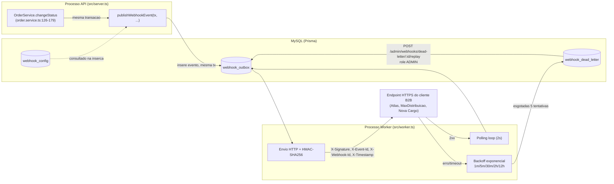

# RFC — Sistema de Webhooks de Notificação de Pedidos (Order Webhooks Notification System)

**Status:** Draft
**Autor:** TBD (documento consolidado a partir da reunião de refinamento técnico; nenhuma autoria individual de redação foi registrada nas fontes)
**Data:** 2026-08-31 (data da reunião de refinamento registrada em `TRANSCRICAO.md`)
**Versão:** 1.0
**Revisores:** Larissa (Tech Lead, condução), Marcos (Product Manager), Bruno (Engenheiro Pleno, time de Pedidos), Diego (Engenheiro Sênior, time de Plataforma), Sofia (Engenheira de Segurança)
**ADRs Relacionadas:** ADR-001, ADR-002, ADR-003, ADR-004, ADR-005, ADR-006, ADR-007, ADR-008

---

## 1. Resumo Executivo (TL;DR)

Três clientes B2B (Atlas Comercial, MaxDistribuição e Nova Cargo) formalizaram o pedido de serem notificados em tempo real (abaixo de 10 segundos) quando o status de seus pedidos muda no OMS, eliminando a necessidade de polling manual em `GET /orders` (`[09:00]-[09:02]` Marcos). Esta RFC propõe evoluir o OMS existente com um sistema de webhooks outbound: a mudança de status de um pedido passa a gerar, de forma atômica, um evento persistido em uma tabela de outbox no MySQL já utilizado pelo projeto; um processo worker separado, em polling, lê essa tabela e entrega os eventos via HTTP, com autenticação HMAC-SHA256, retry com backoff exponencial e Dead Letter Queue (DLQ) para falhas definitivas.

As decisões estruturais centrais desta proposta — padrão outbox, autenticação HMAC por endpoint, garantia at-least-once, política de retry/DLQ e worker em processo separado — já foram fechadas por consenso na reunião de refinamento técnico e formalizadas nas ADR-003 a ADR-008. Esta RFC não reabre essas decisões; ela as integra em uma visão arquitetural única, documenta o problema e o contexto de negócio que as motivou, registra as alternativas descartadas com seus trade-offs, e mantém em aberto os pontos que a própria equipe explicitamente não decidiu (rate limiting de saída, notificação de falha ao cliente, monitoramento de DLQ, entre outros).

---

## 2. Contexto

O OMS (Order Management System) é uma API de gestão de pedidos B2B construída em módulos por domínio (`src/modules/{auth,users,customers,products,orders}`), com uma máquina de estados de pedido (`PENDING → PAID → PROCESSING → SHIPPED → DELIVERED`, com ramos `CANCELLED`) implementada em `src/modules/orders/order.status.ts:3-10` e orquestrada de forma transacional em `OrderService.changeStatus` (`src/modules/orders/order.service.ts:126-179`). Essa transação já debita/repõe estoque (`shouldDebitStock`/`shouldReplenishStock`, `order.status.ts:29-37`), atualiza `Order.status` e insere uma linha de auditoria em `OrderStatusHistory`.

Hoje o sistema não possui nenhum mecanismo de notificação assíncrona: consumidores externos só conseguem saber que um pedido mudou de status fazendo polling em `GET /orders`. Três clientes formalizaram, na semana anterior à reunião, um pedido para receber essas mudanças em tempo real (`[09:00]` Marcos), com a Atlas Comercial sinalizando risco de migração para um concorrente caso a entrega não ocorra até o fim do trimestre. A definição de "tempo real" aceita pelos clientes é qualquer latência abaixo de 10 segundos (`[09:02]` Marcos), e o fluxo é estritamente outbound — a plataforma envia, os clientes apenas recebem (`[09:02]` Sofia; `[09:02]` Marcos).

Nenhuma infraestrutura de mensageria (fila, broker de eventos) é operada pelo time hoje; a única infraestrutura de dados é o MySQL, acessado via Prisma (ADR-002), e a autenticação existente é JWT stateless interno para operadores/administradores (ADR-001), sem qualquer mecanismo de autenticação para consumidores externos.

---

## 3. Problema

Os consumidores externos (clientes B2B) do OMS não possuem hoje nenhum mecanismo de notificação de eventos de domínio: a única forma de saber que o status de um pedido mudou é fazer polling periódico em `GET /orders`, o que é lento e caro para eles operacionalmente e gera acoplamento indireto entre a frequência de polling do cliente e a percepção de atualização do sistema. Essa limitação já gerou insatisfação explícita de clientes estratégicos, com risco concreto de churn de pelo menos um deles até o fim do trimestre (`[09:00]` Marcos).

Do ponto de vista técnico, o sistema não possui hoje nenhum ponto de extensão para publicar eventos de domínio de forma assíncrona e confiável: a única fronteira transacional existente (`OrderService.changeStatus`) não tem como comunicar-se de forma segura com sistemas externos sem acoplar a disponibilidade desses sistemas à disponibilidade da própria transação de negócio.

---

## 4. Objetivos

- Permitir que clientes B2B sejam notificados de mudanças de status de pedidos com latência aceitável abaixo de 10 segundos, sem depender de polling (`[09:02]` Marcos).
- Garantir que a notificação nunca fique inconsistente com o estado real do pedido: se o status mudou, o evento deve existir; se a transação de mudança de status falhar, o evento não deve existir (`[09:40]-[09:41]` Bruno/Diego — formalizado em ADR-003/ADR-006).
- Não introduzir acoplamento síncrono entre a disponibilidade de sistemas externos de clientes e a capacidade do sistema de mudar o status de outros pedidos (`[09:04]` Bruno).
- Fornecer um mecanismo de autenticação e integridade verificável para os eventos entregues a terceiros (ADR-004).
- Reaproveitar ao máximo os padrões arquiteturais já estabelecidos no projeto — módulos por domínio, `AppError`, Pino, error middleware centralizado, Prisma/`PrismaClient`, RBAC via `requireRole` — em vez de introduzir novos padrões ou nova infraestrutura (`[09:30]` Larissa).
- Entregar a primeira versão da feature dentro da estimativa de três sprints comunicada ao time (`[09:45]-[09:46]` Larissa), incluindo revisão de segurança dedicada da Sofia antes do deploy.

---

## 5. Fora do Escopo

- Envio de webhooks inbound (clientes enviando dados para a plataforma) — o fluxo é estritamente outbound (`[09:02]` Sofia/Marcos).
- Notificação alternativa por e-mail em caso de falhas recorrentes de entrega — explicitamente adiada para uma fase futura, após medição de impacto (`[09:37]-[09:38]` Larissa/Marcos).
- Rate limiting de envio de webhooks para clientes com alto volume de eventos simultâneos — reconhecido como ponto relevante, mas deliberadamente deixado como "observar e decidir depois" (`[09:38]-[09:39]` Diego/Larissa).
- Dashboard visual para o cliente gerenciar seus webhooks — fora de escopo desta fase; a interação é somente via API, com o time de frontend tratando um eventual painel como projeto separado (`[09:39]-[09:40]` Larissa/Marcos).
- Endurecimento futuro de RBAC no CRUD de configuração de webhook (ex.: exigir role mais restritiva do que "qualquer usuário autenticado") — mencionado como possibilidade futura, não decidido nesta fase (`[09:36]-[09:37]` Marcos/Sofia).
- Arquivamento/purga de eventos já entregues na outbox após 30 dias — mencionado como necessidade futura, mas explicitamente fora do escopo desta feature (`[09:08]` Diego).
- Suporte a múltiplos workers em paralelo com garantia de ordering global — tratado como evolução futura fora do escopo desta decisão (`[09:12]-[09:13]` Diego/Bruno; ADR-006, ADR-008).
- Detalhamento de endpoints, schemas de request/response, matriz de erros `WEBHOOK_*` e modelagem física completa das tabelas — responsabilidade do FDD, não desta RFC.

---

## 6. Requisitos

### 6.1 Requisitos Funcionais

- O cliente deve poder cadastrar um webhook informando URL de destino e a lista de status de pedido que deseja receber; a secret de assinatura é gerada pela plataforma e devolvida na criação (`[09:31]` Marcos).
- O cliente deve poder editar (`PATCH`), remover (`DELETE`) e listar (`GET`) os webhooks cadastrados para um customer (`[09:33]` Bruno).
- O sistema deve filtrar, no momento da inserção do evento na outbox, quais webhooks daquele customer estão interessados no status resultante da transição, evitando inserir eventos para webhooks que não os solicitaram (`[09:33]-[09:34]` Marcos/Bruno/Diego).
- O cliente deve poder consultar o histórico de entregas de um webhook (últimos eventos enviados, sucesso/falha, payload, response, tempo de resposta) via `GET /webhooks/:id/deliveries` (`[09:34]` Marcos).
- Deve existir um endpoint administrativo para reprocessar manualmente um evento em DLQ, recolocando-o na outbox como pendente (`POST /admin/webhooks/dead-letter/:id/replay`), restrito a usuários com role `ADMIN` (`[09:18]`, `[09:35]-[09:36]` Diego/Sofia/Larissa).
- O endpoint de replay administrativo deve registrar em log de auditoria qual usuário administrador executou cada replay (`[09:36]` Sofia).
- O cliente deve poder rotacionar a secret de um webhook via API, com a secret antiga permanecendo válida por 24 horas em paralelo à nova (`[09:21]` Sofia).
- Cada evento entregue deve carregar um identificador único (`event_id`) que permanece o mesmo em todas as tentativas de reenvio, permitindo deduplicação do lado do cliente (`[09:25]` Diego — ADR-005).
- O restante do CRUD de configuração de webhook (criar/editar/remover/listar) deve exigir apenas autenticação JWT válida, sem exigência de role específica nesta fase (`[09:36]-[09:37]` Sofia).

### 6.2 Requisitos Não Funcionais

- **Performance/Latência:** entrega de eventos com latência inferior a 10 segundos no caso comum; o pior caso aceito nesta proposta é de 2 segundos apenas pela cadência de polling do worker, folgado frente ao requisito de negócio (`[09:09]-[09:10]` Diego/Marcos/Larissa — ADR-008).
- **Confiabilidade/Consistência:** garantia transacional de que a mudança de status de um pedido e o registro do evento correspondente ocorrem atomicamente — nunca um sem o outro (`[09:06]-[09:08]` Diego — ADR-003, ADR-006).
- **Disponibilidade:** o processo de entrega de webhooks (worker) não deve ser afetado por reinícios/deploys do processo da API, e vice-versa (`[09:11]` Diego — ADR-008).
- **Segurança:** autenticidade e integridade de cada evento verificável pelo cliente via HMAC-SHA256, com secret exclusiva por endpoint cadastrado (`[09:19]-[09:22]` Sofia — ADR-004); comunicação obrigatoriamente via HTTPS (`[09:23]` Sofia).
- **Segurança:** limite de tamanho de payload de 64KB, com erro explícito em caso de excesso, em vez de truncamento silencioso (`[09:23]-[09:24]` Sofia/Diego).
- **Resiliência:** tolerância a indisponibilidade de cliente por até aproximadamente 15 horas via retry com backoff exponencial antes de mover o evento para DLQ (`[09:14]-[09:17]` Diego/Bruno/Larissa — ADR-007).
- **Observabilidade:** histórico de entregas (sucesso/falha, payload, response, tempo de resposta) deve ser consultável pelo cliente via API (`[09:34]` Marcos), e falhas definitivas devem ficar auditáveis em DLQ com motivo registrado (`[09:18]` Diego — ADR-007).
- **Manutenibilidade:** o novo módulo deve seguir a convenção estrutural existente (`*.routes.ts → *.controller.ts → *.service.ts → *.repository.ts` + `*.schemas.ts`) e o prefixo de erro `WEBHOOK_*` alinhado à hierarquia `AppError` já existente (`[09:27]-[09:29]` Bruno — `src/shared/errors/app-error.ts`, `src/shared/errors/http-errors.ts`).
- **Escalabilidade:** o desenho aceita, nesta fase, um único worker (`single-worker`) como premissa de ordering; capacidade de múltiplos workers em paralelo é TBD e depende de trabalho futuro de particionamento ou lock pessimista (`[09:12]-[09:13]` Diego/Bruno — ADR-006, ADR-008).
- Volume esperado de eventos, número de clientes simultâneos e throughput-alvo do worker: **TBD** — não há qualquer número, métrica ou projeção de tráfego nas fontes disponíveis.

---

## 7. Restrições

- **Stack tecnológica:** o projeto usa MySQL como único banco de dados via Prisma ORM (ADR-002); não há orçamento, aprovação ou intenção registrada de introduzir um segundo sistema de dados/mensageria (`[09:07]` Diego).
- **Equipe pequena:** a decisão de reaproveitar MySQL em vez de subir Redis Streams ou fila dedicada foi motivada explicitamente pelo tamanho reduzido do time e pelo risco de overengineering (`[09:07]` Diego).
- **Ausência de mecanismo reativo no MySQL:** diferente do PostgreSQL, o MySQL não oferece `LISTEN/NOTIFY`; triggers de banco só executam SQL e não conseguem acionar processos externos, restringindo a leitura da outbox a polling (`[09:09]` Diego — ADR-008).
- **Autenticação interna já estabelecida:** o mecanismo JWT/RBAC (`authenticate`, `requireRole` em `src/middlewares/auth.middleware.ts:27-61`) é reaproveitado sem alteração para os endpoints de configuração de webhook e para o endpoint administrativo de replay (ADR-001).
- **Padrão de erros já estabelecido:** qualquer novo erro do módulo de webhooks deve seguir a hierarquia `AppError` (`src/shared/errors/app-error.ts`, `src/shared/errors/http-errors.ts`) com códigos prefixados `WEBHOOK_*` (`[09:28]` Bruno).
- **Prazo comercial:** a Atlas Comercial condicionou a continuidade do contrato à entrega até o fim do trimestre (`[09:00]` Marcos); a estimativa de entrega é de três sprints, incluindo revisão de segurança da Sofia (`[09:45]-[09:46]` Larissa).
- **Incidente de segurança prévio:** a exigência de secret única por endpoint (em vez de secret global) é motivada por um incidente real já ocorrido, em que um cliente vazou uma secret em log de sua própria aplicação (`[09:22]` Diego — ADR-004).
- **Convenção de identificadores:** todas as entidades do schema atual usam UUID como chave primária; a nova tabela de outbox deve seguir a mesma convenção (`[09:50]-[09:51]` Larissa/Diego).
- Requisitos regulatórios/compliance específicos (ex.: LGPD sobre dados de pedido trafegados a terceiros): **TBD** — não mencionados em nenhuma fonte disponível.
- Limitações de orçamento de infraestrutura: **TBD** — não quantificadas nas fontes.

---

## 8. ADRs Relacionadas e Decisões Já Confirmadas

| ADR | Título | Relação com esta RFC |
|---|---|---|
| **ADR-001** | Estratégia de Autenticação JWT Stateless com Hash de Senha via bcrypt | **Fundação reaproveitada.** O mecanismo `authenticate`/`requireRole` já existente é usado sem alteração para proteger os endpoints de configuração de webhook (autenticação básica) e o endpoint administrativo de replay de DLQ (exigência de role `ADMIN`). Esta RFC não propõe nenhuma mudança ao modelo de autenticação interno. |
| **ADR-002** | Prisma como ORM Único e PrismaClient em Singleton por Processo | **Fundação reaproveitada e estendida.** Toda a persistência de outbox, configuração de webhook e DLQ propostas nesta RFC usa Prisma sobre o MySQL existente. A ADR-002 já confirma explicitamente a extensão do padrão de singleton de `PrismaClient` por processo para a nova topologia de dois processos (API + worker) introduzida por esta proposta. |
| **ADR-003** | Publicação Atômica de Eventos de Webhook via Outbox dentro de `OrderService.changeStatus` | **Decisão confirmada, citada diretamente.** Define o ponto de integração exato desta proposta: a inserção do evento ocorre dentro da mesma transação de `changeStatus` via uma função pura `publishWebhookEvent(tx, order, fromStatus, toStatus)`, em vez de injeção de um `WebhookRepository` completo. Esta RFC herda essa decisão sem reabri-la. |
| **ADR-004** | Autenticação de Webhooks via HMAC-SHA256 com Secret Única por Endpoint e Rotação | **Decisão confirmada, citada diretamente.** Define o mecanismo de segurança de toda entrega proposta nesta RFC: HMAC-SHA256 sobre o corpo do evento, secret exclusiva por endpoint cadastrado, rotação via API com grace period de 24h. |
| **ADR-005** | Garantia de Entrega At-Least-Once com Idempotência via X-Event-Id | **Decisão confirmada, citada diretamente.** Define a semântica de entrega assumida por toda a proposta: at-least-once, com deduplicação delegada ao cliente via `X-Event-Id` (UUID gerado na inserção do evento na outbox e propagado em retries). |
| **ADR-006** | Padrão Outbox no MySQL para Entrega de Eventos de Webhook | **Decisão confirmada, citada diretamente.** Formaliza o uso do MySQL existente (via tabela `webhook_outbox`, ainda a ser criada) como mecanismo de outbox, descartando fila externa dedicada e disparo síncrono. Esta RFC adota essa decisão como base arquitetural central. |
| **ADR-007** | Política de Retry com Backoff Exponencial e Dead Letter Queue | **Decisão confirmada, citada diretamente.** Define a política de resiliência de entrega: 5 tentativas com backoff de 1m/5m/30m/2h/12h, DLQ em tabela dedicada (`webhook_dead_letter`) e endpoint administrativo de replay restrito a `ADMIN`. |
| **ADR-008** | Worker de Entrega em Processo Separado com Polling | **Decisão confirmada, citada diretamente.** Define a topologia de execução do consumidor de eventos: processo Node separado (`src/worker.ts`), polling a cada 2 segundos, `PrismaClient` próprio por processo. Esta RFC adota essa decisão como parte da arquitetura de entrega. |

Não há, nas fontes disponíveis, nenhuma ADR relacionada a rate limiting de saída, notificação de falha ao cliente por e-mail, ou monitoramento/purga de DLQ — esses temas permanecem como questões em aberto (Seção 21) e não como decisões confirmadas.

---

## 9. Proposta Técnica

Esta RFC propõe estender o OMS existente com um módulo de webhooks outbound (`src/modules/webhooks`, seguindo a convenção estrutural já usada pelos demais domínios) e um processo worker dedicado (`src/worker.ts`), sem introduzir nenhum componente de infraestrutura novo além do MySQL já operado pelo time.

A abordagem proposta é: quando `OrderService.changeStatus` (`src/modules/orders/order.service.ts:126-179`) completa com sucesso uma transição de status, a mesma transação SQL passa a inserir um evento snapshot (`event_id`, tipo, timestamps, dados básicos do pedido) na tabela de outbox, restrito aos webhooks daquele customer que declararam interesse no status resultante (ADR-003, ADR-006). Essa inserção usa uma função pura que recebe o client de transação já aberto, evitando acoplar o módulo de pedidos a um repositório completo do módulo de webhooks.

Um processo Node separado, o worker (ADR-008), varre periodicamente a outbox em polling e realiza as chamadas HTTP de entrega, assinando cada payload com HMAC-SHA256 e uma secret exclusiva do endpoint de destino (ADR-004). A entrega segue garantia at-least-once, com um identificador único (`X-Event-Id`) propagado em todas as tentativas para permitir deduplicação do lado do cliente (ADR-005). Falhas de entrega acionam uma política de retry com backoff exponencial; após esgotadas as tentativas, o evento é movido para uma tabela de Dead Letter Queue dedicada, reprocessável manualmente por um endpoint administrativo restrito a `ADMIN` (ADR-007).

A proposta desta RFC não introduz decisões novas além do que já foi fechado nas ADR-003 a ADR-008 — sua contribuição é articular essas decisões como uma arquitetura coesa, situá-las no contexto de negócio que as originou, e expor claramente o que ainda não foi decidido. Detalhamento de endpoints, schemas de request/response e a matriz completa de erros `WEBHOOK_*` ficam a cargo do FDD.

---

## 10. Arquitetura

A arquitetura proposta introduz, pela primeira vez no projeto, uma topologia de dois processos Node coordenados exclusivamente pelo banco de dados compartilhado (ADR-002, ADR-008): o processo HTTP da API (`src/server.ts`, existente) e um novo processo worker (`src/worker.ts`, proposto).

Ambos os processos mantêm sua própria instância de `PrismaClient`, apontando para a mesma `DATABASE_URL` (ADR-002), sem nenhum mecanismo de coordenação além do próprio banco. Não há fila externa, broker de mensagens ou serviço de notificação de terceiros nesta proposta — toda a coordenação entre "produção" do evento (API) e "consumo" (worker) passa pela tabela de outbox no MySQL.

---

## 11. Componentes e Domínios

- **Módulo `orders` (existente, estendido):** `OrderService.changeStatus` passa a invocar `publishWebhookEvent(tx, order, fromStatus, toStatus)` dentro da mesma transação já existente, sem incorporar lógica de persistência do módulo de webhooks (ADR-003).
- **Módulo `webhooks` (novo, proposto):** segue a convenção estrutural do projeto (`*.routes.ts → *.controller.ts → *.service.ts → *.repository.ts` + `*.schemas.ts`), conforme proposto por Bruno em `[09:27]-[09:28]`. Responsável por:
  - CRUD de configuração de webhook (URL, secret, status de interesse, customer).
  - Consulta de histórico de entregas.
  - Endpoint administrativo de replay de DLQ.
  - Função `publishWebhookEvent` consumida por `OrderService`.
  - Lógica de processamento/envio, proposta em `[09:28]` Bruno como um arquivo dentro do módulo (ex.: `webhook.worker.ts` ou `webhook.processor.ts`).
- **Processo `worker` (novo, proposto):** entry-point separado `src/worker.ts`, espelhando a estrutura de `src/server.ts`, responsável por executar o loop de polling, orquestrar retries e mover eventos esgotados para DLQ (ADR-008).
- **Infraestrutura compartilhada reaproveitada, sem alteração:** `AppError`/hierarquia de erros (`src/shared/errors/`), logger Pino (`src/shared/logger/`), `error.middleware.ts`, `auth.middleware.ts` (`authenticate`/`requireRole`), `src/config/database.ts` (padrão de singleton de `PrismaClient` por processo) e `src/config/env.ts` (validação Zod de variáveis de ambiente).

---

## 12. Dados e Persistência

O schema atual (`prisma/schema.prisma`) não possui nenhum modelo relacionado a webhooks, outbox ou eventos — todos os modelos existentes (`User`, `Customer`, `Product`, `Order`, `OrderItem`, `OrderStatusHistory`, `OrderNumberSequence`) são exclusivamente do domínio de pedidos. Esta proposta requer a criação de novos modelos Prisma, mantendo a convenção de UUID como chave primária já usada em todo o schema (`[09:50]-[09:51]` Larissa/Diego):

- Uma tabela de outbox (`webhook_outbox`, nome mencionado nominalmente em `[09:06]` Diego), com evento persistido como snapshot já renderizado no momento da inserção — e não recalculado no momento do envio — para refletir fielmente o estado do pedido no instante da transição, mesmo que o pedido seja alterado posteriormente (`[09:51]-[09:52]` Larissa/Diego/Bruno). Diego menciona indexação por campo de status (pendente/processando/falhou/entregue) e por `created_at` para suportar a leitura eficiente pelo worker (`[09:07]-[09:08]`).
- Uma tabela de configuração de webhook, armazenando ao menos URL, secret, `customer_id` e estado ativo (`[09:21]` Bruno/Sofia).
- Uma tabela de Dead Letter Queue (`webhook_dead_letter`), separada da outbox principal, com payload do evento, motivo da falha e timestamp (`[09:18]` Diego — ADR-007).

O desenho físico completo desses modelos (nomes de campos, tipos, índices adicionais, relacionamentos formais em `schema.prisma`) é responsabilidade do FDD, não desta RFC.

Arquivamento de eventos já entregues após 30 dias foi mencionado como necessidade futura, mas está explicitamente fora do escopo desta feature (`[09:08]` Diego). Política de retenção de registros em DLQ já reprocessados: **QUESTÃO EM ABERTO** (não discutida na reunião nem coberta pelas ADRs — ver ADR-007, seção de Consequências).

---

## 13. APIs e Integrações

Do lado interno (exposto pela plataforma), a proposta prevê minimamente os seguintes pontos de integração levantados na reunião — o detalhamento de contrato (schemas, códigos de status HTTP, matriz de erros) é responsabilidade do FDD:

- CRUD de configuração de webhook: criação (URL + lista de status de interesse; secret gerada e devolvida na criação), edição, remoção e listagem por customer (`[09:31]-[09:33]` Marcos/Bruno).
- Consulta de histórico de entregas por webhook (`GET /webhooks/:id/deliveries`) (`[09:34]` Marcos).
- Rotação de secret via API, com grace period de 24h (`[09:21]` Sofia).
- Endpoint administrativo de replay de evento em DLQ (`POST /admin/webhooks/dead-letter/:id/replay`), restrito a role `ADMIN` (`[09:18]`, `[09:35]-[09:36]` Diego/Sofia).

Do lado externo (integração de saída, plataforma → cliente), cada chamada de entrega carrega os seguintes headers, conforme fechado em `[09:44]-[09:45]` Diego/Sofia:

- `X-Event-Id`: UUID único do evento, constante entre tentativas de retry (ADR-005).
- `X-Signature`: assinatura HMAC-SHA256 do corpo do request (ADR-004).
- `X-Timestamp`: timestamp do envio, permitindo ao cliente detectar replay attacks se desejar.
- `X-Webhook-Id`: identificador do cadastro de webhook, permitindo a um cliente com múltiplos endpoints saber qual cadastro recebeu o evento (`[09:44]` Sofia).
- `Content-Type: application/json`.

O payload JSON contém `event_id`, `event_type` (ex.: `"order.status_changed"`), timestamp ISO 8601, `order_id`, `order_number`, `from_status`, `to_status`, `customer_id` e campos básicos do pedido (ex.: `total_cents`) — deliberadamente sem os itens do pedido, para manter o payload enxuto; o cliente que precisar de detalhes deve consultar `GET /orders/:id` (`[09:43]-[09:44]` Diego/Bruno). Timeout de chamada HTTP do worker: 10 segundos (`[09:42]` Diego/Sofia).

---

## 14. Segurança

- **Autenticidade e integridade:** todo evento é assinado com HMAC-SHA256 sobre o corpo do request, com secret exclusiva por endpoint cadastrado — nunca uma secret global da plataforma (`[09:19]-[09:21]` Sofia — ADR-004). Essa escolha é motivada por um incidente real de vazamento de secret em log de aplicação de um cliente (`[09:22]` Diego).
- **Rotação de credenciais:** a secret é rotacionável via API; durante a rotação, a secret antiga permanece válida por 24 horas em paralelo à nova, evitando indisponibilidade do lado do cliente durante a migração (`[09:21]` Sofia). Não há, nas fontes disponíveis, um fluxo definido de revogação de emergência de uma secret comprometida antes do fim do grace period — ponto sinalizado como lacuna na própria ADR-004.
- **Transporte:** URLs de webhook devem ser obrigatoriamente HTTPS; cadastro com `http://` é recusado por validação de schema (`[09:23]` Sofia).
- **Limite de payload:** eventos com corpo superior a 64KB não são enviados; o sistema deve retornar erro explícito em vez de truncar silenciosamente (`[09:23]-[09:24]` Sofia/Diego).
- **Controle de acesso:** o CRUD de configuração de webhook exige apenas JWT válido (qualquer role) nesta fase; o endpoint administrativo de replay de DLQ exige role `ADMIN`, reaproveitando o `requireRole` já existente (`[09:35]-[09:36]` Sofia/Larissa — ADR-007), com exigência de log de auditoria por replay executado (`[09:36]` Sofia).
- **Armazenamento da secret em repouso:** **QUESTÃO EM ABERTO** — a ADR-004 registra explicitamente a ausência de definição sobre se a secret será armazenada em texto plano, com hash, ou criptografada com chave de aplicação/KMS; esse ponto impacta diretamente o risco residual de um vazamento de banco de dados e não foi decidido na reunião.
- **Revisão dedicada:** a Sofia reservou pelo menos dois dias úteis de revisão de segurança específica sobre HMAC e geração de secret antes do deploy (`[09:46]` Sofia/Larissa).

---

## 15. Escalabilidade e Performance

- A latência-alvo de entrega (abaixo de 10 segundos) é atendida com folga pelo polling de 2 segundos do worker, mesmo no pior caso (`[09:09]-[09:10]` Diego/Marcos — ADR-008).
- A leitura da outbox pelo worker deve ser feita em lotes pequenos ("batch pequeno"), com índice em campo de status e em `created_at`, segundo Diego (`[09:07]-[09:08]`); dimensionamento exato de tamanho de lote é **TBD**, sem número fechado na reunião.
- O modelo assume explicitamente um único worker em execução (`single-worker`) como premissa de ordering: eventos do mesmo `order_id` são entregues na ordem correta apenas enquanto houver um único worker processando a outbox em ordem de `created_at` (`[09:12]` Diego). Não há garantia de ordering global entre pedidos distintos — os clientes nunca solicitaram essa garantia (`[09:14]` Marcos).
- Evolução para múltiplos workers em paralelo exigiria resolver particionamento por `order_id` ou lock pessimista — tratado como problema futuro, deliberadamente fora do escopo desta proposta (`[09:13]` Diego/Bruno).
- Volume de eventos esperado, número de clientes simultâneos ativos e throughput-alvo do worker sob carga real: **TBD** — nenhuma métrica ou projeção numérica está disponível nas fontes.
- Rate limiting de envio para clientes que gerem picos de eventos (ex.: 50 pedidos mudando de status em um minuto) foi identificado como risco em potencial, mas deliberadamente não endereçado nesta fase — ver Seção 21.

---

## 16. Observabilidade

- **Logs:** o módulo de webhooks deve reaproveitar o logger Pino já configurado no projeto (`src/shared/logger/index.ts`), sem introduzir novo mecanismo de logging (`[09:29]` Bruno).
- **Tratamento de erros:** o middleware de erro centralizado (`src/middlewares/error.middleware.ts`) já trata `AppError`, `ZodError` e erros conhecidos do Prisma; os novos erros `WEBHOOK_*` devem seguir a mesma hierarquia `AppError` sem exigir mudanças no middleware (`[09:29]` Bruno).
- **Auditoria:** toda execução do endpoint administrativo de replay de DLQ deve ser logada com o usuário responsável (`[09:36]` Sofia).
- **Histórico de entregas exposto ao cliente:** cada tentativa de entrega (sucesso ou falha), incluindo payload, response e tempo de resposta, deve ficar disponível para consulta pelo cliente via `GET /webhooks/:id/deliveries` (`[09:34]` Marcos) — este histórico é também a principal fonte de observabilidade operacional mencionada nas fontes.
- **Monitoramento de DLQ:** não há, nas fontes disponíveis, definição de processo ou responsável formal para revisão periódica dos itens acumulados em `webhook_dead_letter`, apesar de a equipe ter reconhecido essa necessidade como consequência de longo prazo (ADR-007) — ver Seção 21.
- Métricas de negócio/operacionais (ex.: taxa de sucesso de entrega, latência p95, volume de eventos por hora) não foram discutidas na reunião: **TBD**.

---

## 17. Alternativas Consideradas

### Alternativa 1 — Disparo síncrono de webhook dentro de `OrderService.changeStatus`

Chamar o endpoint HTTP do cliente B2B diretamente dentro da própria transação de mudança de status, sem outbox nem worker intermediário. Foi a primeira opção discutida na reunião, antes de qualquer menção a outbox (`[09:03]` Larissa: "a gente dispara isso sincronamente no service de orders quando o status muda, ou faz algum tipo de fila/outbox?").

**Vantagens**

- Implementação mais simples no curto prazo, sem necessidade de tabela adicional nem processo worker.
- Entrega imediata ao cliente, sem a latência mínima introduzida por um ciclo de polling.

**Desvantagens**

- Uma chamada HTTP lenta ou um cliente indisponível travaria a mudança de status de outros pedidos, já que a transação de `changeStatus` é descrita como "pesada" (atualiza `orders`, insere em `order_status_history`, decrementa `stock_quantity`) (`[09:04]` Bruno).
- Não haveria como reverter (rollback) coerentemente a notificação caso o cliente estivesse fora do ar no meio da chamada (`[09:04]` Bruno).
- Descartada por consenso imediato de Larissa e Bruno antes mesmo da chegada de Diego à call (`[09:04]-[09:05]`).

### Alternativa 2 — Fila externa dedicada (Redis Streams ou equivalente)

Publicar o evento em uma fila de mensageria dedicada fora do MySQL, consumida por um worker independente, em vez de usar uma tabela de outbox no banco relacional já existente.

**Vantagens**

- Desacoplaria completamente a infraestrutura de mensageria do banco transacional principal, com maior throughput potencial.
- Suporte nativo a múltiplos consumidores e escalonamento horizontal.

**Desvantagens**

- Reintroduziria o problema clássico de dupla escrita (dual-write) entre MySQL e a fila externa, sem garantia atômica nativa entre o commit da transação de pedidos e a publicação na fila — exatamente o problema que o outbox no mesmo banco evita (`[09:07]` Diego).
- Exigiria subir e operar infraestrutura adicional (ex.: Redis Cluster), considerado overengineering para o tamanho da equipe (`[09:07]` Diego: "a gente é um time pequeno. Subir Redis Cluster pra isso é overengineering.").
- Descartada em favor do outbox em MySQL, decisão fechada explicitamente por Larissa em `[09:08]` ("Tá decidido então: outbox em MySQL").

### Alternativa considerada adicional — Trigger de banco para acionar o worker reativamente

Ainda que de menor peso na discussão, também foi levantada e descartada a ideia de usar um trigger de banco de dados para notificar o worker de forma reativa em vez de por polling (`[09:09]` Bruno: "Não dá pra usar trigger do banco pra ser mais reativo?"). Foi descartada porque o MySQL não possui mecanismo equivalente ao `LISTEN/NOTIFY` do PostgreSQL, e um trigger só executa SQL — não consegue acionar um processo externo — o que exigiria soluções paliativas (escrever em arquivo, chamar um endpoint) consideradas frágeis pela equipe (`[09:09]` Diego). O polling de 2 segundos foi considerado suficiente frente ao requisito de latência abaixo de 10 segundos.

---

## 18. Trade-offs

- **Consistência forte vs. latência mínima:** a escolha do padrão outbox com polling garante que nenhum evento seja perdido ou "fantasma", mas introduz uma latência mínima inerente de até 2 segundos (o intervalo de polling), em vez da entrega instantânea que um disparo síncrono ofereceria — trade-off aceito porque ainda folga com relação ao requisito de negócio de 10 segundos (ADR-006, ADR-008).
- **Simplicidade operacional vs. throughput/escalabilidade futura:** operar um único worker é operacionalmente mais simples e preserva ordering por `order_id`, mas limita a capacidade de escalar horizontalmente o consumo de eventos; evoluir para múltiplos workers exigirá resolver particionamento ou lock pessimista, problema deliberadamente adiado (`[09:12]-[09:13]` Diego/Bruno).
- **Reuso de infraestrutura existente (MySQL) vs. componente de mensageria dedicado:** reaproveitar o MySQL evita subir e operar infraestrutura nova para um time pequeno, mas aceita o teto de desempenho e a ausência de notificação reativa nativa que uma fila dedicada ofereceria (`[09:07]` Diego).
- **Responsabilidade de deduplicação transferida ao cliente vs. simplicidade de entrega:** garantir apenas at-least-once mantém o backend simples (sem coordenação distribuída), mas desloca uma responsabilidade de engenharia real (deduplicação por `X-Event-Id`) para cada cliente B2B integrador — objeção explícita levantada por Sofia (`[09:25]`) e aceita conscientemente pela equipe (ADR-005).
- **Janela de resiliência ampla vs. eventos "em voo" por mais tempo:** a política de 5 tentativas com backoff até 12h cobre indisponibilidades de cliente de até ~15 horas (cobrindo um caso real já vivido pela equipe), mas mantém eventos não confirmados "em voo" por um período consideravelmente mais longo do que uma política mais agressiva de 3 tentativas ofereceria (`[09:15]-[09:17]` Diego/Bruno/Larissa — ADR-007).
- **Isolamento de credenciais vs. complexidade de gestão de ciclo de vida:** secret única por endpoint (em vez de secret global) reduz o raio de impacto de um vazamento a um único cadastro, mas exige gestão de ciclo de vida de múltiplas secrets (geração, armazenamento, rotação, expiração) — responsabilidade nova que o projeto nunca precisou assumir antes, já que a autenticação JWT interna é stateless (ADR-001 vs. ADR-004).
- **Acoplamento transacional entre domínios vs. garantia de consistência:** inserir o evento de webhook dentro da mesma transação de `OrderService.changeStatus` garante atomicidade, mas estabelece um precedente de acoplamento: qualquer efeito colateral futuro de `changeStatus` (não só webhooks) terá que decidir explicitamente se entra ou não nessa fronteira transacional, e a transação — já descrita como "pesada" — passa a incluir mais uma escrita (ADR-003).

---

## 19. Impacto e Riscos

**Impacto**

- **Equipe de Pedidos (Bruno):** `OrderService.changeStatus` passa a ter uma dependência funcional nova (`publishWebhookEvent`), ainda que desacoplada via função pura recebendo `tx`; qualquer mudança futura nesse método precisa preservar a inserção do evento dentro da mesma transação.
- **Equipe de Plataforma (Diego):** passa a operar, pela primeira vez no projeto, um segundo processo de longa duração (`src/worker.ts`), com necessidade de supervisão/restart em caso de falha — mecanismo ainda não definido (ver ADR-008, `[PRECISA DE INFORMAÇÃO]`).
- **Segurança (Sofia):** ganha uma responsabilidade contínua nova de revisão de mecanismos de autenticação externa (HMAC, geração e rotação de secret), com pelo menos dois dias reservados antes do primeiro deploy (`[09:46]`).
- **Produto (Marcos)/Clientes B2B:** os três clientes que solicitaram a feature (Atlas Comercial, MaxDistribuição, Nova Cargo) passam a depender operacionalmente da confiabilidade desse mecanismo de notificação; a documentação do contrato de entrega (at-least-once, dedup client-side) precisa ser publicada de forma destacada no portal de desenvolvedor (`[09:26]` Marcos).
- **Processos existentes:** nenhuma rota ou fluxo hoje existente (`orders`, `customers`, `products`, `users`, `auth`) é removido ou alterado em seu comportamento externo; a mudança é aditiva sobre `OrderService.changeStatus`.

**Riscos e mitigações**

| Risco | Mitigação proposta / registrada |
|---|---|
| Segundo processo de longa duração (worker) sem mecanismo de supervisão/restart definido em caso de crash. | **Sem mitigação definida nas fontes** — ADR-008 registra explicitamente essa lacuna como `[PRECISA DE INFORMAÇÃO]`; deve ser resolvido antes da entrega. |
| Aumento da duração/contenção de locks na transação já "pesada" de `changeStatus` pela escrita adicional na outbox. | Aceito conscientemente pela equipe como custo necessário para garantir atomicidade (ADR-003); não há medição de impacto real disponível — **TBD**. |
| Vazamento de secret de webhook comprometendo autenticidade de eventos para um cliente. | Isolamento por secret única por endpoint (blast radius limitado a um cadastro) e suporte a rotação com grace period de 24h (ADR-004). Revogação de emergência antes do fim do grace period permanece sem fluxo definido — questão em aberto. |
| Cliente processa o mesmo evento mais de uma vez (at-least-once). | Deduplicação client-side via `X-Event-Id`, documentada de forma destacada no portal de desenvolvedor (ADR-005, `[09:26]` Marcos). |
| Eventos "pendurados" indefinidamente para um cliente permanentemente offline. | Teto de 5 tentativas com backoff exponencial, movendo o evento para DLQ ao esgotar (ADR-007). |
| Falha definitiva de entrega passa despercebida sem monitoramento formal de DLQ. | **Sem mitigação definida** — ADR-007 registra a ausência de processo/responsável formal de revisão periódica da DLQ como lacuna explícita. |
| Pico de eventos para um único cliente (ex.: 50 mudanças de status em um minuto) sobrecarregando o endpoint do cliente. | **Sem mitigação definida nesta fase** — tratado deliberadamente como "observar e decidir depois" (`[09:38]-[09:39]` Diego/Larissa). |
| Perda de garantia de ordering ao evoluir para múltiplos workers no futuro. | Aceito como limitação conhecida do design atual (single-worker); solução (particionamento por `order_id` ou lock pessimista) fica para decisão futura (ADR-006, ADR-008). |
| Migração futura de at-least-once para exactly-once ser disruptiva para integrações já em produção que implementaram dedup baseada em `X-Event-Id`. | Nenhuma mitigação de longo prazo definida além da documentação do contrato atual; ADR-005 registra isso como questão em aberto sobre SLA de comunicação a clientes já integrados. |

---

## 20. Estratégia de Migração / Rollout

A estimativa comunicada pela Tech Lead é de três sprints, decompostas informalmente da seguinte forma (`[09:45]-[09:46]` Larissa):

1. Modelagem da tabela de outbox e da DLQ — aproximadamente uma sprint.
2. Implementação do worker e da política de retry — aproximadamente uma sprint.
3. CRUD de configuração de webhook e endpoint de histórico de entregas — aproximadamente meia sprint.
4. Integração no `OrderService.changeStatus` e testes ponta a ponta — aproximadamente meia sprint.
5. Implementação de HMAC, schemas de validação Zod e demais validações de segurança — tempo adicional não quantificado.

A revisão de segurança dedicada da Sofia (mínimo dois dias úteis, focada em HMAC e geração de secret) está incluída no fim dessa janela, antes do deploy (`[09:46]` Larissa/Sofia). Como próximo passo imediato, a Tech Lead declarou a intenção de abrir um documento de design da feature e agendar uma sessão de revisão com Bruno e Diego antes do início da implementação (`[09:50]` Larissa).

Não há, nas fontes disponíveis, uma estratégia formal de rollout gradual (ex.: feature flag, liberação por cliente, ambiente de staging dedicado para os três clientes B2B) nem um plano de rollback caso a feature apresente problemas em produção: **QUESTÃO EM ABERTO**.

---

## 21. Questões em Aberto

- **Rate limiting de envio para clientes com picos de eventos:** levantado por Diego como preocupação real (cenário de 50 pedidos mudando de status em um minuto), mas explicitamente não incorporado ao escopo desta fase — a decisão registrada foi "observar e decidir depois" (`[09:38]-[09:39]` Diego/Larissa).
- **Notificação automática ao cliente em caso de falhas recorrentes de entrega (ex.: e-mail após 3 falhas seguidas):** perguntado por Marcos e explicitamente adiado para uma fase futura, condicionado à medição de impacto da versão atual (`[09:37]-[09:38]` Marcos/Larissa).
- **Armazenamento da secret em repouso** (texto plano, hash, ou criptografia com KMS/chave de aplicação): não decidido na reunião; registrado como lacuna explícita na ADR-004.
- **Fluxo de revogação de emergência de uma secret comprometida** durante a janela de grace period de 24h: não discutido na reunião nem coberto pelo código; lacuna explícita na ADR-004.
- **Processo/responsável formal de monitoramento periódico da DLQ:** reconhecido pela equipe como necessidade de longo prazo, mas sem definição de dono ou cadência; lacuna explícita na ADR-007.
- **Política de retenção de registros em DLQ** (já reprocessados ou nunca reprocessados) antes de purga/arquivamento: não discutida na reunião nem coberta pelo código; lacuna explícita na ADR-007.
- **Mecanismo de supervisão/restart do processo worker em caso de crash** (gerenciador de processos, orquestrador, health check): a equipe reconheceu a necessidade de tratar "erros não capturados" no ciclo de vida do worker, mas não fechou como isso será operacionalizado; lacuna explícita na ADR-008.
- **Endurecimento futuro de RBAC no CRUD de configuração de webhook:** Marcos perguntou se o restante do CRUD poderia permanecer com qualquer role autenticada; Sofia respondeu "por enquanto sim. Mais pra frente a gente pode endurecer" — decisão futura não fechada (`[09:36]-[09:37]`).
- **Estratégia formal de rollout gradual e plano de rollback em produção:** não mencionados em nenhum momento da reunião nem cobertos pelas ADRs — QUESTÃO EM ABERTO identificada nesta RFC (Seção 20).
- **Volume de tráfego esperado, número de clientes simultâneos e throughput-alvo do worker sob carga real:** nenhuma métrica ou projeção numérica está disponível nas fontes — TBD.

---

## 22. Status da Proposta

**Status:** PENDING REVIEW

Esta RFC consolida decisões arquiteturais que já foram debatidas e fechadas por consenso na reunião de refinamento técnico de 2026-08-31 e formalizadas nas ADR-003 a ADR-008 (além da fundação já estabelecida nas ADR-001 e ADR-002). Nesse sentido, os elementos centrais da arquitetura (outbox em MySQL, HMAC-SHA256, at-least-once, retry/DLQ, worker separado) não estão em aberto para reconsideração nesta RFC — eles são tratados como decisões confirmadas e citadas por identificador.

O que permanece sujeito a revisão e discussão técnica adicional é a articulação geral da proposta como um todo, a viabilidade do prazo de três sprints frente ao escopo consolidado, e — principalmente — as questões em aberto listadas na Seção 21, que a própria equipe reconheceu não ter fechado.

Após a revisão, esta proposta poderá ser aprovada, modificada ou rejeitada em suas partes ainda não cobertas por ADR. Qualquer nova decisão arquitetural que resulte dessa revisão (por exemplo, sobre rate limiting, monitoramento de DLQ, ou armazenamento de secret em repouso) deverá ser registrada posteriormente em uma ADR apropriada.

---

## 23. Próximos Passos

- Abrir o documento de design (FDD) da feature, detalhando endpoints, schemas Zod, matriz de erros `WEBHOOK_*` e modelagem física completa das tabelas propostas (outbox, configuração de webhook, DLQ), conforme intenção declarada por Larissa (`[09:50]`).
- Agendar sessão de revisão técnica do design com Bruno e Diego antes do início da implementação (`[09:50]` Larissa).
- Reservar a janela de revisão de segurança dedicada da Sofia (mínimo dois dias úteis) sobre HMAC e geração de secret antes do deploy (`[09:46]`).
- Resolver, antes ou durante a implementação, as questões em aberto identificadas na Seção 21 que bloqueiam decisões de design do FDD (em especial armazenamento de secret em repouso e mecanismo de supervisão do worker).
- Marcos deve atualizar os três clientes B2B (Atlas Comercial, MaxDistribuição, Nova Cargo) sobre o prazo estimado (`[09:47]` Marcos).
- Formalizar em ADR qualquer decisão nova que surgir da resolução das questões em aberto (ex.: política de rate limiting, se e quando for endereçada).

---

## 24. Histórico de Revisões

| Versão | Data | Autor | Alteração |
|---|---|---|---|
| 1.0 | 2026-08-31 | TBD | Criação inicial, consolidando `TRANSCRICAO.md`, ADR-001 a ADR-008 e evidências de código (`src/modules/orders`, `prisma/schema.prisma`, `src/shared/errors`, `src/middlewares`). |
