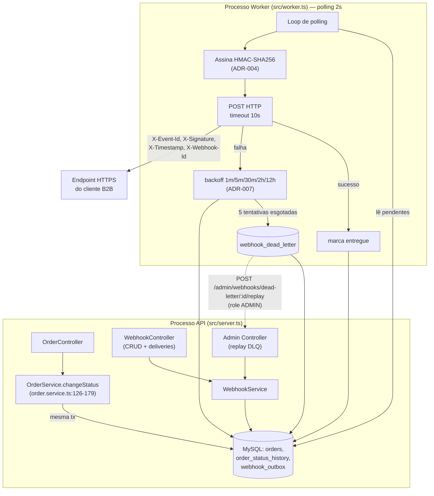

# RFC — Order Webhooks Notification System

**Status:** Draft
**Autor:** TBD
**Data:** 2026-09-08
**Versão:** 1.0
**ADRs Relacionadas:** ADR-001, ADR-002, ADR-003, ADR-004, ADR-005, ADR-006, ADR-007, ADR-008

---

## 1. Resumo

Esta RFC descreve a arquitetura proposta para o **Order Webhooks Notification System**, uma extensão do OMS (Order Management System) existente que passa a notificar clientes B2B externos, via HTTP callback assinado, sempre que o status de um pedido muda. A proposta combina seis decisões técnicas já fechadas e formalizadas em ADRs dedicadas — outbox transacional em MySQL (`ADR-006`, com o ponto de integração descrito em `ADR-003`), retry com backoff exponencial e DLQ (`ADR-007`), worker de entrega em processo separado com polling (`ADR-008`), autenticação HMAC-SHA256 com secret por endpoint (`ADR-004`) e garantia de entrega at-least-once via `X-Event-Id` (`ADR-005`) — com decisões de infraestrutura de mais longo prazo já consolidadas no projeto (JWT stateless, `ADR-001`; Prisma como ORM único, `ADR-002`). O propósito desta RFC não é reabrir essas seis decisões pontuais, mas apresentar como elas se encaixam em um desenho arquitetural coerente, cobrir os aspectos ainda não fechados em nenhuma ADR (contrato de API do módulo `webhooks`, modelo de dados de configuração, observabilidade, riscos de integração entre as peças) e registrar as questões que permanecem em aberto.

## 2. Contexto

Três clientes B2B — Atlas Comercial, MaxDistribuição e Nova Cargo — formalizaram um pedido para serem notificados em tempo real quando o status de seus pedidos muda na plataforma, com a Atlas sinalizando risco de migração para um concorrente caso a entrega não ocorra até o fim do trimestre (`[09:00] Marcos`). Hoje esses clientes fazem polling periódico em `GET /orders`, o que Marcos descreve como uma integração "lenta e cara" para eles (`[09:00] Marcos`). O requisito de latência aceito pelos clientes é qualquer valor abaixo de 10 segundos, tratado por eles como "tempo real" (`[09:02] Marcos`).

O escopo foi definido logo no início da reunião como estritamente **outbound**: a plataforma envia eventos para os clientes, e não o contrário (`[09:02]-[09:03] Sofia/Marcos`). Do ponto de vista técnico, o único ponto do sistema que hoje altera o status de um pedido é `OrderService.changeStatus` (`src/modules/orders/order.service.ts:126-179`), que já executa, dentro de um único `prisma.$transaction`, a validação da transição de estado (`canTransition`, `src/modules/orders/order.status.ts:12-14`), o débito/reposição de estoque (`shouldDebitStock`/`shouldReplenishStock`, `src/modules/orders/order.status.ts:29-37`) e a gravação de auditoria em `OrderStatusHistory` (`prisma/schema.prisma:116-131`). Essa transação foi descrita pela própria equipe como "já pesada" (`[09:04] Bruno`), o que molda diretamente a proposta desta RFC.

## 3. Problema

O sistema não possui hoje nenhum mecanismo de notificação assíncrona de eventos de domínio para consumidores externos — a única forma de um cliente externo saber que um pedido mudou de status é fazer polling manual e repetido em `GET /orders`. Isso gera custo de integração crescente para os clientes B2B à medida que o volume de pedidos aumenta, e cria risco comercial explícito (churn) quando esse custo ultrapassa o que o cliente está disposto a tolerar (`[09:00] Marcos`).

Adicionalmente, qualquer solução que acople o disparo da notificação à transação síncrona de mudança de status introduz um novo problema técnico: a confiabilidade da notificação de um pedido passaria a depender da disponibilidade de um sistema de terceiro fora do controle da plataforma, com risco de travar mudanças de status de *outros* pedidos caso o cliente externo esteja lento ou indisponível (`[09:04] Bruno`), sem que exista uma forma coerente de reverter apenas a notificação em caso de falha (`[09:04] Bruno`).

## 4. Objetivos

- Notificar clientes B2B sobre mudanças de status de pedido em latência aceitável abaixo de 10 segundos (`[09:02] Marcos`).
- Eliminar a dependência de polling em `GET /orders` como mecanismo primário de sincronização de estado para integradores externos.
- Garantir que a notificação nunca fique inconsistente com o estado real do pedido — nem eventos "fantasma" sem mudança real, nem mudanças de status sem evento correspondente (`ADR-003`, `ADR-006`).
- Não introduzir acoplamento síncrono entre a disponibilidade de sistemas de terceiros e a transação crítica de mudança de status de pedidos (`[09:04]-[09:08]`).
- Fornecer autenticidade e integridade verificáveis do lado do cliente para cada evento recebido (`ADR-004`).
- Reaproveitar ao máximo os padrões, mecanismos e infraestrutura já existentes no projeto — módulos, tratamento de erros, autenticação, ORM, logging — em vez de introduzir componentes novos sem necessidade (`[09:30] Larissa`; `ADR-002`).
- Entregar a primeira versão dentro do prazo estimado de três sprints, incluindo revisão de segurança dedicada (`[09:45]-[09:47]`).

## 5. Fora do Escopo

- Notificação por e-mail em caso de falhas recorrentes de entrega — adiado explicitamente para uma fase futura (`[09:37]-[09:38] Marcos/Larissa`).
- Rate limiting de envio de webhooks para um mesmo cliente em rajadas de eventos — a equipe optou por observar o comportamento em produção antes de decidir implementar (`[09:38]-[09:39] Diego/Larissa`).
- Dashboard visual para o cliente acompanhar seus webhooks — tratado como projeto separado do time de frontend, fora do escopo desta feature (`[09:39]-[09:40] Larissa`).
- Garantia de ordering global de entrega entre pedidos distintos — a ordenação é assegurada apenas por `order_id` e apenas enquanto houver um único worker em execução (`[09:12]-[09:13]`, `ADR-008`).
- Arquivamento/purga de eventos já entregues na tabela de outbox — mencionado como necessidade futura, mas explicitamente fora do escopo desta feature (`[09:08] Diego`).
- Suporte a webhooks *inbound* (clientes enviando dados para a plataforma) — descartado no início da reunião (`[09:02]-[09:03] Sofia/Marcos`).
- Evolução da topologia de worker para múltiplos processos em paralelo, incluindo particionamento por `order_id` ou lock pessimista — declarada como problema de arquitetura futuro, fora do escopo atual (`[09:13] Diego`; `ADR-006`; `ADR-008`).
- Modelo de permissão granular por `customer_id` para os endpoints de configuração de webhook — o time optou por manter esses endpoints abertos a qualquer role autenticada "por enquanto" (`[09:36]-[09:37] Sofia/Marcos`), sem desenhar o modelo de permissão mais fino nesta fase.

## 6. Requisitos

### 6.1 Requisitos Funcionais

- O cliente (via usuário autenticado do OMS) deve poder cadastrar um webhook informando `url`, `customer_id` e a lista de status de pedido que deseja receber; a `secret` é gerada pela plataforma e devolvida na criação (`[09:31]-[09:32] Marcos`).
- O sistema deve permitir editar (`PATCH`), remover (`DELETE`) e listar (`GET`) os webhooks cadastrados de um customer (`[09:33] Bruno`).
- O sistema deve permitir configurar, por endpoint de webhook, quais status de pedido disparam notificação (filtro de eventos) (`[09:33]-[09:34] Marcos/Bruno`).
- A filtragem de eventos deve ocorrer no momento da inserção na outbox: se nenhum webhook do customer estiver interessado naquele status, o evento não deve ser inserido (`[09:34] Bruno/Diego`).
- O sistema deve expor o histórico de entregas de um webhook (`GET /webhooks/:id/deliveries`), incluindo sucesso/falha, payload, response e tempo de resposta, para as últimas entregas (`[09:34]-[09:35] Marcos`; quantidade referida como "últimos 100" nesse trecho da transcrição, sem constar como limite formalmente decidido — ver seção 21).
- O sistema deve fornecer um endpoint administrativo para reprocessar manualmente um evento em DLQ (`POST /admin/webhooks/dead-letter/:id/replay`), recolocando-o na outbox como pendente (`[09:18] Diego`; `[09:35] Larissa`; `ADR-007`).
- O endpoint de replay de DLQ deve exigir role `ADMIN` e registrar log de auditoria de quem executou o replay (`[09:35]-[09:36] Sofia/Larissa`; `ADR-007`).
- A rotação de secret de um endpoint de webhook deve ser possível via API, mantendo a secret antiga válida por 24 horas em paralelo à nova (`[09:21]-[09:22] Sofia`; `ADR-004`).
- O payload do evento deve conter, no mínimo: `event_id`, `event_type` (ex.: `"order.status_changed"`), `timestamp` ISO 8601, `order_id`, `order_number`, `from_status`, `to_status`, `customer_id` e campos básicos do pedido como `total_cents` — sem incluir os itens do pedido, para manter o payload enxuto (`[09:43] Diego`).
- Os cabeçalhos de cada requisição de webhook devem incluir `X-Event-Id`, `X-Signature`, `X-Timestamp` e `X-Webhook-Id`, além de `Content-Type: application/json` (`[09:44]-[09:45] Diego/Sofia`).

### 6.2 Requisitos Não Funcionais

- **Performance/Latência:** entrega em até 10 segundos é o requisito aceito pelo cliente; o desenho com polling de 2 segundos atende esse requisito com folga (`[09:02] Marcos`; `[09:09]-[09:10]`; `ADR-008`).
- **Confiabilidade:** garantia de entrega at-least-once, nunca exactly-once (`ADR-005`); nenhuma falha definitiva deve ser descartada silenciosamente — toda falha esgotada vai para DLQ (`ADR-007`).
- **Segurança:** autenticidade e integridade via HMAC-SHA256 com secret por endpoint (`ADR-004`); TLS obrigatório — a plataforma deve recusar cadastro de URL de webhook que não seja `https` (`[09:23] Sofia`, tratado como validação de schema Zod e não como decisão arquitetural separada).
- **Segurança/limite de payload:** eventos que ultrapassem 64KB não devem ser enviados; a plataforma deve retornar/registrar erro em vez de truncar o payload (`[09:23]-[09:24] Sofia/Diego/Larissa`, também tratado como requisito não funcional, não como decisão arquitetural separada).
- **Resiliência:** timeout de 10 segundos por chamada HTTP do worker antes de considerar falha e acionar retry (`[09:42] Diego`; `ADR-007`).
- **Disponibilidade operacional:** a entrega de webhooks não pode ser interrompida por reinício/deploy do processo da API (`[09:11] Diego`; `ADR-008`).
- **Manutenibilidade:** o novo módulo deve seguir a mesma estrutura de camadas (`controller → service → repository → routes` + `schemas`) já usada pelos demais domínios do projeto (`[09:27]-[09:28] Bruno`).
- **Observabilidade:** TBD além do reuso do logger Pino e do middleware de erro já existentes — não há decisão registrada sobre métricas ou tracing dedicados ao módulo de webhooks (ver seção 16 e 21).

## 7. Restrições

- **Stack tecnológica existente:** MySQL como banco relacional (`prisma/schema.prisma:5-9`), sem mecanismo nativo de notificação assíncrona a processos externos (`ADR-006`, `ADR-008`) — restringe as opções viáveis de leitura da outbox a polling.
- **Time pequeno, sem infraestrutura de mensageria operada:** motivou a rejeição de filas externas dedicadas (ex.: Redis Streams) por overengineering (`[09:07] Diego`; `ADR-006`).
- **Padrões de projeto já estabelecidos e que devem ser reaproveitados:** estrutura de módulo (`src/modules/{domínio}/*.routes.ts → *.controller.ts → *.service.ts → *.repository.ts` + `*.schemas.ts`), hierarquia `AppError`/`errorCode` (`src/shared/errors/app-error.ts`, `src/shared/errors/http-errors.ts`), middleware de erro centralizado (`src/middlewares/error.middleware.ts`), logger Pino (`src/shared/logger`), autenticação JWT/RBAC via `authenticate`/`requireRole` (`src/middlewares/auth.middleware.ts:27-61`; `ADR-001`) e Prisma como ORM único (`ADR-002`) (`[09:30] Larissa`).
- **Convenção de identificadores:** todo o schema atual usa UUID (`@db.Char(36)`) como chave primária em todas as entidades (`prisma/schema.prisma`); a nova outbox e o `event_id` seguem a mesma convenção (`[09:50]-[09:51] Larissa/Diego`; `ADR-005`).
- **Topologia de processos:** até esta feature, o projeto opera com um único processo Node de longa duração (`src/server.ts`); a introdução do worker (`src/worker.ts`) é a primeira vez que o sistema passa a operar dois processos coordenados apenas pelo banco compartilhado (`ADR-008`).
- **Prazo comercial:** a Atlas solicitou entrega até o fim de novembro; a equipe estimou três sprints, incluindo revisão de segurança dedicada de pelo menos dois dias úteis antes do deploy (`[09:45]-[09:47] Marcos/Larissa/Sofia`).
- **Modelo de permissão binário existente:** o RBAC atual (`ADMIN`/`OPERATOR`) não possui conceito de escopo por `customer_id`; os endpoints CRUD de configuração de webhook ficam abertos a qualquer role autenticada nesta fase (`[09:36]-[09:37]`), o que é uma restrição herdada do modelo de autenticação existente (`ADR-001`) e não uma limitação nova desta feature.

## 8. ADRs Relacionadas e Decisões Já Confirmadas

Todas as decisões abaixo são tratadas como **fundação confirmada** desta RFC, não como propostas em aberto. A RFC não redebate nenhuma delas; ela descreve como se encaixam no desenho arquitetural mais amplo.

- **`ADR-001` — Estratégia de Autenticação JWT Stateless com Hash de Senha via bcrypt.** Status: Aceita. Fundamenta esta RFC ao definir que todos os endpoints CRUD de configuração de webhook e o endpoint administrativo de replay de DLQ reutilizam o mecanismo `authenticate`/`requireRole` já existente (`src/middlewares/auth.middleware.ts:27-61`), sem necessidade de um novo esquema de autenticação para usuários internos.
- **`ADR-002` — Prisma como ORM Único e PrismaClient em Singleton por Processo.** Status: Aceita. Restringe e fundamenta o modelo de persistência: toda nova tabela (outbox, DLQ, configuração de webhook) será modelada em `prisma/schema.prisma` e acessada via Prisma Client; a topologia de dois processos (API + worker) deve manter uma instância própria de `PrismaClient` por processo, apontando para a mesma `DATABASE_URL`.
- **`ADR-003` — Publicação Atômica de Eventos de Webhook via Outbox dentro de `OrderService.changeStatus`.** Status: Proposta (decisão fechada em reunião, aguardando implementação). Define o ponto de integração exato entre o domínio ORDERS e o módulo WEBHOOKS: a função pura `publishWebhookEvent(tx, order, fromStatus, toStatus)`, chamada dentro da transação já existente em `changeStatus` (`src/modules/orders/order.service.ts:126-179`), em vez de injeção de um `WebhookRepository` completo.
- **`ADR-004` — Autenticação de Webhooks via HMAC-SHA256 com Secret Única por Endpoint e Rotação.** Status: Proposta. Fundamenta a seção de Segurança desta RFC: assinatura HMAC-SHA256 do corpo de cada evento, secret única por endpoint cadastrado (não secret global) e rotação com grace period de 24h.
- **`ADR-005` — Garantia de Entrega At-Least-Once com Idempotência via X-Event-Id.** Status: Aceita. Fundamenta o contrato de entrega: a plataforma não garante exactly-once; cabe ao cliente deduplicar via `X-Event-Id`, um UUID gerado na inserção do evento na outbox e reenviado inalterado em cada retentativa.
- **`ADR-006` — Padrão Outbox no MySQL para Entrega de Eventos de Webhook.** Status: Proposta. Fundamenta a escolha estrutural central desta RFC: outbox transacional sobre o MySQL existente, descartando envio síncrono e fila externa dedicada, com um worker assíncrono separado consumindo a tabela.
- **`ADR-007` — Política de Retry com Backoff Exponencial e Dead Letter Queue.** Status: Aceita. Fundamenta o comportamento de resiliência do worker: 5 tentativas com backoff de 1m/5m/30m/2h/12h, DLQ em tabela dedicada `webhook_dead_letter`, endpoint administrativo de replay restrito a `ADMIN` com auditoria.
- **`ADR-008` — Worker de Entrega em Processo Separado com Polling.** Status: Proposta. Fundamenta a topologia de execução: processo Node dedicado (`src/worker.ts`, script `npm run worker`), polling a cada 2 segundos, instância própria de `PrismaClient`, isolado do ciclo de vida da API.

Não há ADR relacionada, até o momento, cobrindo o modelo de dados de **configuração** de webhook (tabela de cadastro de endpoint/secret/customer_id/status ativo) nem o contrato de API completo dos endpoints CRUD — esses aspectos são tratados nesta RFC como parte do desenho mais amplo ainda não fechado em ADR individual (ver seções 12 e 13).

## 9. Solução Proposta

Esta RFC propõe estruturar o Order Webhooks Notification System como um novo módulo de domínio, `src/modules/webhooks`, seguindo o mesmo padrão de camadas dos módulos existentes (`[09:27]-[09:28] Bruno`), composto por:

1. Uma **tabela de configuração de webhooks** (nome exato do model ainda não definido — ver seção 21), armazenando `url`, `secret`, `customer_id`, lista/filtro de status desejados e estado ativo/inativo (`[09:21] Bruno`).
2. A tabela `webhook_outbox`, populada dentro da mesma transação de `OrderService.changeStatus` via a função `publishWebhookEvent(tx, order, fromStatus, toStatus)` (`ADR-003`, `ADR-006`), com o payload já renderizado como snapshot no momento da inserção (`[09:51]-[09:52] Larissa/Diego/Bruno`).
3. Um processo worker dedicado (`src/worker.ts`), rodando em polling de 2 segundos, responsável por ler eventos pendentes, assiná-los com HMAC-SHA256, enviá-los via HTTP e classificar o resultado (`ADR-008`).
4. Uma política de retry com backoff exponencial e uma tabela `webhook_dead_letter` para falhas esgotadas, com endpoint administrativo de replay (`ADR-007`).
5. Endpoints REST de CRUD de configuração de webhook e de consulta de histórico de entregas, protegidos pela autenticação JWT existente (`ADR-001`), com o endpoint de replay de DLQ restrito à role `ADMIN`.

A proposta desta RFC — no que ainda não está coberto por ADR individual — é que o módulo `webhooks` exponha essas responsabilidades de forma coesa, mantendo `OrderService` desacoplado de detalhes de persistência do módulo WEBHOOKS (apenas a função pura `publishWebhookEvent` cruza a fronteira, por decisão já fechada em `ADR-003`), e que o worker seja tratado como um segundo "consumidor" interno do mesmo banco, sem qualquer acoplamento em tempo de execução com o processo da API além do banco compartilhado.

## 10. Arquitetura

A API e o worker são processos independentes, coordenados exclusivamente pelo estado persistido no MySQL (`ADR-008`) — não há chamada direta entre os dois processos. A atomicidade entre a mudança de status e o registro do evento é garantida inteiramente dentro da transação de `changeStatus` (`ADR-003`, `ADR-006`); tudo o que ocorre depois do commit (assinatura, envio HTTP, retry, DLQ) é responsabilidade exclusiva do worker.

## 11. Componentes e Domínios

Consistente com a estrutura observada em `src/modules/{auth,users,customers,products,orders}/`, cada um seguindo `*.routes.ts → *.controller.ts → *.service.ts → *.repository.ts` (+ `*.schemas.ts`), a proposta é:

- **`src/modules/webhooks/webhook.routes.ts`** — rotas de CRUD de configuração e de histórico de entregas, montadas via `authenticate` (`ADR-001`), seguindo o padrão de `src/routes/index.ts:21-31` (`buildApiRouter` agregando roteadores por módulo).
- **`src/modules/webhooks/webhook.controller.ts`**, **`webhook.service.ts`**, **`webhook.repository.ts`**, **`webhook.schemas.ts`** — camadas equivalentes às já existentes em `src/modules/orders/`.
- **`src/modules/webhooks/webhook.worker.ts` ou `webhook.processor.ts`** — lógica de processamento (leitura da outbox, assinatura, envio, retry) referenciada como possível nome de arquivo na reunião, sem decisão fechada sobre qual dos dois nomes usar (`[09:28] Bruno`; ver seção 21).
- **`src/worker.ts`** — novo entry-point de processo, análogo estruturalmente a `src/server.ts`, com script `npm run worker` (`ADR-008`).
- **Integração com `src/modules/orders/order.service.ts`** — a única alteração no módulo ORDERS é a chamada a `publishWebhookEvent(tx, ...)` dentro de `changeStatus` (`ADR-003`); nenhuma outra mudança estrutural no domínio de pedidos é proposta.
- **Reuso transversal:** `src/shared/errors/app-error.ts` e `src/shared/errors/http-errors.ts` como base para novos erros `WEBHOOK_*`; `src/middlewares/error.middleware.ts` sem alteração, pois já trata qualquer `AppError`, `ZodError` e erros conhecidos do Prisma; `src/shared/logger` para logging do worker e do módulo `webhooks`; `src/config/database.ts` como padrão de criação do `PrismaClient` também para o worker (`ADR-002`).

## 12. Dados e Persistência

Nenhuma das tabelas abaixo existe hoje em `prisma/schema.prisma` — são todas propostas novas:

- **Tabela de configuração de webhook** (nome do model ainda não definido — `QUESTÃO EM ABERTO`, ver seção 21): campos discutidos incluem `url`, `secret`, `customer_id`, lista de status filtrados e estado ativo (`[09:21] Bruno`), com suporte a secret antiga/nova durante rotação (`ADR-004`).
- **`webhook_outbox`** (`ADR-006`): evento de mudança de status com payload já renderizado como snapshot no momento da inserção (`[09:51]-[09:52]`), campo de status do próprio evento (pendente/processando/falhou/entregue) e `created_at`, com índices sobre esses dois campos para leitura eficiente pelo worker em batches pequenos (`[09:07]-[09:08] Diego`). Chave primária em UUID, consistente com o restante do schema (`[09:50]-[09:51]`; `ADR-005`).
- **`webhook_dead_letter`** (`ADR-007`): payload do evento, motivo da falha e timestamp, populada quando as 5 tentativas de retry se esgotam.

A filtragem de quais webhooks devem receber cada evento ocorre no momento da inserção na outbox, não no momento do envio (`[09:34] Bruno/Diego`) — se nenhum webhook do customer estiver interessado no status resultante, nenhuma linha é inserida. `ADR-003` já registra como `QUESTÃO EM ABERTO` a forma exata dessa consulta dentro da mesma `tx` e seu impacto na duração do lock da transação de `changeStatus` — esta RFC não resolve esse ponto, apenas o herda.

Arquivamento ou purga de eventos já entregues (mencionado como "depois de 30 dias ou assim") está fora do escopo desta fase (`[09:08] Diego`; seção 5).

## 13. APIs e Integrações

Os seguintes endpoints foram discutidos na reunião como parte do contrato funcional do módulo `webhooks`, mas nenhum deles possui uma ADR dedicada — são tratados aqui como parte da proposta desta RFC, com o prefixo de rota `/api/v1/*` inferido por consistência com o padrão observado em `src/routes/index.ts:21-31` (Assumido, não citado literalmente na transcrição):

| Método | Rota (proposta) | Autenticação | Descrição |
|---|---|---|---|
| `POST` | `/webhooks` | JWT (qualquer role) | Cadastra webhook; `secret` gerada pela plataforma e devolvida na resposta (`[09:31]-[09:32]`) |
| `PATCH` | `/webhooks/:id` | JWT (qualquer role) | Edita configuração do webhook (`[09:33]`) |
| `DELETE` | `/webhooks/:id` | JWT (qualquer role) | Remove webhook (`[09:33]`) |
| `GET` | `/webhooks` | JWT (qualquer role) | Lista webhooks de um customer (`[09:33]`) |
| `GET` | `/webhooks/:id/deliveries` | JWT (qualquer role) | Histórico de entregas (sucesso/falha, payload, response, tempo de resposta) (`[09:34]-[09:35]`) |
| `POST` | `/admin/webhooks/dead-letter/:id/replay` | JWT + role `ADMIN` | Reprocessa evento em DLQ, recolocando-o na outbox como pendente (`[09:18]`, `[09:35]-[09:36]`; `ADR-007`) |

A integração de saída (worker → cliente) segue o contrato definido em `ADR-004` e `ADR-005`: `POST` HTTPS para a `url` cadastrada, corpo JSON conforme seção 6.1, cabeçalhos `X-Event-Id`, `X-Signature`, `X-Timestamp`, `X-Webhook-Id` e `Content-Type: application/json` (`[09:44]-[09:45]`).

`QUESTÃO EM ABERTO`: nomes exatos de rota, formato de resposta e paginação de `GET /webhooks/:id/deliveries` (a transcrição menciona "últimos 100" apenas de forma coloquial, sem fechar como limite de paginação formal) não foram detalhados na reunião nem existem em código — devem ser especificados em um Design Doc/FDD subsequente.

## 14. Segurança

- **Autenticidade e integridade dos eventos:** HMAC-SHA256 sobre o corpo do request, com secret única por endpoint cadastrado — não secret global — para limitar o raio de impacto de um vazamento a um único cadastro, motivado por um incidente real já ocorrido com um cliente (`ADR-004`; `[09:19]-[09:22] Sofia/Diego`).
- **Rotação de secret:** suportada via API, com grace period de 24h em que ambas as secrets (antiga e nova) são válidas simultaneamente (`ADR-004`).
- **Transporte:** TLS obrigatório — cadastro de URL não-HTTPS deve ser recusado na validação de schema (`[09:23] Sofia`).
- **Limite de payload:** eventos acima de 64KB não devem ser enviados; a plataforma deve tratar isso como erro, não como truncamento (`[09:23]-[09:24]`).
- **Autorização interna:** endpoints CRUD de configuração exigem apenas autenticação JWT padrão, sem restrição de role (`[09:36]-[09:37]`); o endpoint de replay de DLQ exige role `ADMIN`, reaproveitando `requireRole` (`src/middlewares/auth.middleware.ts:49-61`), com exigência explícita de log de auditoria de quem executou o replay (`[09:35]-[09:36] Sofia`; `ADR-007`).
- **Responsabilidade do cliente:** garantia de entrega at-least-once transfere a responsabilidade de deduplicação para o lado do cliente via `X-Event-Id` — um trade-off de segurança/confiabilidade explicitamente aceito e a ser documentado no portal de desenvolvedor (`ADR-005`; `[09:26] Marcos`).
- **Lacunas de segurança identificadas em ADR mas não resolvidas nesta RFC:** forma de armazenamento da secret em repouso (texto plano, hash ou criptografada) — `NEEDS INPUT` em `ADR-004`; fluxo de revogação de emergência de uma secret comprometida durante a própria janela de rotação — `NEEDS INPUT` em `ADR-004`. Esta RFC não resolve essas lacunas; herda-as como questões em aberto (seção 21).

## 15. Escalabilidade e Performance

O worker opera em modelo **single-worker** com polling a cada 2 segundos, o que atende com folga o requisito de latência de 10 segundos (`ADR-008`), mas implica que a garantia de ordering de entrega só existe por `order_id`, e apenas enquanto houver exatamente um worker em execução (`[09:12]-[09:13]`; `ADR-006`, `ADR-008`). Evoluir para múltiplos workers em paralelo exigiria resolver particionamento por `order_id` ou lock pessimista, problema declarado como futuro e fora do escopo atual (`[09:13] Diego`).

A tabela `webhook_outbox` deve ter índices sobre o campo de status do evento e sobre `created_at`, para que o worker leia apenas os eventos pendentes mais antigos em lotes pequenos (`[09:07]-[09:08] Diego`). Não há, nas fontes disponíveis, uma definição de tamanho de lote (`batch size`) de leitura — `TBD`.

Rate limiting de saída para um mesmo cliente em rajadas de eventos foi levantado como preocupação real (ex.: 50 pedidos mudando de status no mesmo minuto), mas a equipe decidiu observar o comportamento em produção antes de decidir se implementa (`[09:38]-[09:39] Diego/Larissa`) — tratado nesta RFC como risco aceito conscientemente (seção 19), não como requisito desta fase.

## 16. Observabilidade

A proposta é reaproveitar integralmente a infraestrutura de observabilidade já existente, sem introduzir componente novo: o logger Pino (`src/shared/logger`) deve ser usado tanto pelo módulo `webhooks` quanto pelo processo `src/worker.ts`, e o middleware de erro centralizado (`src/middlewares/error.middleware.ts:14-65`) já trata qualquer `AppError` lançado pelos novos endpoints sem necessidade de alteração (`[09:29] Bruno`).

Do lado de auditoria funcional, o histórico de entregas exposto via `GET /webhooks/:id/deliveries` (seção 13) funciona como observabilidade de negócio voltada ao cliente, e o log de auditoria do endpoint de replay de DLQ (`[09:36] Sofia`) cobre a rastreabilidade de ações administrativas.

Não há, em nenhuma das três fontes, decisão sobre métricas dedicadas (ex.: taxa de sucesso de entrega, tamanho da fila de outbox pendente, volume de DLQ) nem sobre alertas operacionais. `ADR-007` já registra como `NEEDS INPUT` a ausência de um processo formal de monitoramento periódico da DLQ — esta RFC não resolve essa lacuna, apenas a explicita como questão em aberto (seção 21).

## 17. Alternativas Consideradas

As três alternativas abaixo foram discutidas e explicitamente descartadas durante a reunião, já formalizadas como `REJEITADA` nas ADRs correspondentes. Esta RFC não as reabre — elas são reproduzidas aqui em nível de arquitetura de sistema porque moldam por que o desenho proposto na seção 9 e 10 tem o formato que tem.

### Alternativa 1 — Disparo síncrono de webhook dentro de `OrderService.changeStatus`

Chamar o endpoint HTTP do cliente diretamente dentro da mesma transação de mudança de status, sem outbox nem worker.

**Vantagens**
- Implementação mais simples no curto prazo, sem tabela outbox nem processo adicional.
- Entrega imediata, sem a latência mínima de um ciclo de polling.

**Desvantagens**
- Um cliente lento ou indisponível trava a mudança de status de outros pedidos (`[09:04] Bruno`).
- Sem possibilidade de rollback coerente caso a chamada HTTP falhe no meio da transação (`[09:04] Bruno`).
- Acopla a confiabilidade do domínio de pedidos à disponibilidade de sistemas de terceiros.

Formalmente rejeitada em `ADR-003` e `ADR-006`.

### Alternativa 2 — Fila externa dedicada (Redis Streams ou equivalente)

Publicar o evento em uma fila de mensageria externa ao MySQL, consumida por um worker independente.

**Vantagens**
- Desacoplaria completamente a entrega de eventos da transação de banco, com maior throughput potencial.
- Suportaria múltiplos consumidores e escalonamento horizontal nativo.

**Desvantagens**
- Reintroduz o problema clássico de dupla escrita (dual-write) entre MySQL e a fila, que o outbox no mesmo banco evita (`[09:07] Diego`).
- Exige subir e operar infraestrutura nova, considerada overengineering para o tamanho da equipe (`[09:07] Diego`).
- Nenhuma garantia atômica nativa entre o commit da transação de pedidos e a publicação na fila.

Formalmente rejeitada em `ADR-006`.

### Alternativa 3 — Mecanismo reativo via trigger de banco de dados

Usar um trigger de banco disparado na atualização de `Order` para acionar o worker de forma reativa, em vez de polling.

**Vantagens**
- Potencial de latência de entrega mais próxima de zero.
- Evita execução periódica de queries em tabelas eventualmente vazias.

**Desvantagens**
- MySQL não possui mecanismo nativo equivalente ao `LISTEN/NOTIFY` do PostgreSQL (`[09:09] Diego`).
- Um trigger só executa SQL, não consegue notificar um processo externo; soluções paliativas (escrever em arquivo, chamar endpoint) foram consideradas frágeis e fora do padrão pela equipe (`[09:09] Diego`).
- Complexidade adicional não se justifica frente a um requisito de latência (<10s) já atendido com folga pelo polling de 2s.

Formalmente rejeitada em `ADR-006` e `ADR-008`.

A análise de alternativas em nível de sistema (por exemplo, arquiteturas orientadas a eventos com broker dedicado, ou serviços gerenciados de terceiros para entrega de webhooks) não foi realizada pela equipe nesta reunião — não há evidência nas fontes de que essas opções tenham sido sequer cogitadas, e esta RFC não as inventa.

## 18. Trade-offs

- **Simplicidade operacional vs. latência mínima garantida:** reaproveitar o MySQL via outbox evita subir infraestrutura nova, mas introduz uma latência mínima inerente de até 2 segundos por causa do polling, em vez de entrega verdadeiramente orientada a eventos (`ADR-006`, `ADR-008`).
- **Simplicidade de contrato vs. responsabilidade transferida ao cliente:** garantir apenas at-least-once evita coordenação distribuída complexa do lado da plataforma, mas exige que cada cliente B2B implemente e mantenha sua própria lógica de deduplicação via `X-Event-Id` (`ADR-005`; objeção explícita de `[09:25] Sofia`).
- **Isolamento de segurança vs. complexidade de gestão de credenciais:** secret por endpoint (em vez de secret global) reduz o raio de impacto de um vazamento, mas introduz a necessidade de gerir ciclo de vida (geração, rotação, expiração) de uma credencial por cadastro — problema que o projeto nunca precisou resolver antes, já que a autenticação interna via JWT é stateless (`ADR-004`; contraste com `ADR-001`).
- **Consistência forte pontual vs. acoplamento entre módulos:** garantir atomicidade entre mudança de status e registro do evento exige que `OrderService` chame uma função do módulo WEBHOOKS dentro de sua própria transação, criando um ponto de acoplamento entre domínios que precisa ser mantido estável à medida que o módulo WEBHOOKS evolui (`ADR-003`).
- **Resiliência de curto prazo vs. capacidade operacional futura:** o modelo single-worker com ordering apenas por `order_id` é suficiente e simples para o volume e o requisito atuais, mas qualquer evolução futura para múltiplos workers exigirá redesenho de coordenação (particionamento ou lock pessimista) (`ADR-006`, `ADR-008`).
- **Janela de tolerância a falhas vs. tempo de detecção de problemas recorrentes:** a janela de retry de ~15 horas (`ADR-007`) cobre bem indisponibilidades pontuais de cliente, mas, combinada com a ausência de notificação automática de falha (email adiado, `[09:37]-[09:38]`), significa que problemas recorrentes de entrega só são percebidos pelo próprio cliente reportando, ou por checagem manual da DLQ.

## 19. Riscos

- **Worker sem mecanismo de supervisão/restart definido.** Se o único processo worker falhar ou travar, toda a entrega de webhooks para todos os clientes para até que alguém reinicie o processo manualmente. `ADR-008` já registra isso como `NEEDS INPUT`: não há decisão sobre gerenciador de processos, orquestrador ou health check. *Mitigação possível (não decidida pelas fontes):* definir um mecanismo de supervisão de processo antes do rollout em produção — `QUESTÃO EM ABERTO`.
- **Acúmulo de itens na DLQ sem processo de revisão definido.** `ADR-007` registra como `NEEDS INPUT` a ausência de um responsável ou rotina formal de monitoramento periódico de `webhook_dead_letter`. Sem isso, falhas definitivas podem se acumular sem que ninguém perceba. *Mitigação possível:* definir um processo operacional de revisão periódica da DLQ como pré-requisito de rollout — `QUESTÃO EM ABERTO`.
- **Ausência de rate limiting de saída.** Um cliente com muitos pedidos mudando de status em curto intervalo pode receber um volume alto de chamadas HTTP quase simultâneas; a equipe decidiu observar antes de agir (`[09:38]-[09:39]`). *Mitigação:* nenhuma implementada nesta fase; risco aceito conscientemente e a ser reavaliado com base em dados reais de produção.
- **Vazamento de secret de webhook.** Já ocorreu um incidente real com um cliente vazando secret em log de aplicação (`[09:22] Diego`). *Mitigação já decidida:* secret por endpoint (isola o raio de impacto) e suporte a rotação com grace period (`ADR-004`). Risco residual: ausência de fluxo de revogação de emergência durante a própria janela de rotação (`ADR-004`, `NEEDS INPUT`).
- **Acoplamento entre o domínio ORDERS e o módulo WEBHOOKS.** Ainda que mitigado pelo desenho de função pura recebendo `tx` em vez de repositório completo (`ADR-003`), qualquer mudança futura em `changeStatus` precisa preservar a chamada a `publishWebhookEvent` dentro da mesma transação, sob risco de romper silenciosamente a garantia de consistência (`ADR-003`, `ADR-006`). *Mitigação:* cobertura de testes de integração que validem a atomicidade entre mudança de status e inserção na outbox.
- **Aumento da duração/contenção de locks na transação de `changeStatus`.** A transação já era descrita como "pesada" antes desta feature (`[09:04] Bruno`); a inserção de mais uma escrita (outbox) mais uma possível consulta de configuração de webhooks dentro da mesma `tx` (ainda não detalhada, `ADR-003` `NEEDS INPUT`) tende a aumentar a janela de contenção de locks no banco. *Mitigação possível:* medir o impacto real em ambiente de teste antes do rollout — `QUESTÃO EM ABERTO`.
- **Crescimento não controlado da tabela `webhook_outbox`.** Eventos entregues devem ser arquivados após um período (mencionado como "30 dias ou assim"), mas essa rotina está fora do escopo desta feature (`[09:08] Diego`). *Risco:* a tabela pode crescer indefinidamente até que uma feature de arquivamento seja implementada.
- **Migração futura para exactly-once seria disruptiva.** Uma vez que clientes implementem dedup baseada em `X-Event-Id` sob o contrato at-least-once, uma futura mudança de garantia de entrega seria potencialmente disruptiva para integrações já em produção (`ADR-005`, `NEEDS INPUT` sobre SLA de comunicação a clientes já integrados).

## 20. Estratégia de Migração / Rollout

Trata-se de uma feature inteiramente nova, sem dados legados a migrar: as tabelas de configuração de webhook, `webhook_outbox` e `webhook_dead_letter` não existem hoje em `prisma/schema.prisma` e serão criadas via migration nova (`prisma migrate dev`, conforme convenção já usada no projeto).

A sequência de implementação estimada pela equipe, em três sprints, foi (`[09:45]-[09:46] Larissa`):

1. Modelagem de outbox e DLQ — 1 sprint.
2. Worker e retry — 1 sprint.
3. CRUD de configuração e histórico de entregas — meio sprint.
4. Integração em `OrderService.changeStatus` e testes ponta a ponta — meio sprint.
5. HMAC, schemas e validações — tempo adicional não quantificado separadamente.

Antes do deploy em produção, a equipe reservou pelo menos dois dias úteis de revisão de segurança dedicada, especificamente sobre a implementação de HMAC e geração de secret (`[09:46]-[09:47] Sofia/Larissa`). Larissa também indicou a intenção de abrir um documento de design da feature e marcar uma sessão de revisão com Bruno e Diego antes do início da implementação (`[09:50] Larissa`) — nenhum detalhe adicional sobre feature flags, rollout gradual por cliente, ou plano de rollback foi discutido nas fontes disponíveis (`QUESTÃO EM ABERTO`).

## 21. Questões em Aberto

- Nome exato do model/tabela de configuração de webhook (endpoint, secret, customer_id, filtro de status, estado ativo) — discutido em termos de campos, mas nunca nomeado formalmente na reunião. `TBD`.
- Nome exato do arquivo de processamento do worker dentro do módulo (`webhook.worker.ts` ou `webhook.processor.ts`) — as duas opções foram citadas sem decisão fechada (`[09:28] Bruno`). `TBD`.
- Rate limiting de envio de webhooks para clientes com alto volume de eventos simultâneos — declarado como "observar e decidir depois" (`[09:38]-[09:39]`). `QUESTÃO EM ABERTO`.
- Notificação automática ao cliente (ex.: e-mail) quando webhooks falham recorrentemente — adiado explicitamente para fase futura (`[09:37]-[09:38]`). `QUESTÃO EM ABERTO`.
- Mecanismo de supervisão/restart do processo worker em caso de crash — não definido (`ADR-008`, `NEEDS INPUT`). `QUESTÃO EM ABERTO`.
- Processo e responsável formal por monitorar e revisar periodicamente os itens acumulados em `webhook_dead_letter` — não definido (`ADR-007`, `NEEDS INPUT`). `QUESTÃO EM ABERTO`.
- Tempo de retenção de registros de DLQ já reprocessados (ou nunca reprocessados) antes de purga/arquivamento — não definido (`ADR-007`, `NEEDS INPUT`). `QUESTÃO EM ABERTO`.
- Forma de armazenamento da secret em repouso (texto plano, hash ou criptografada com KMS/chave de aplicação) — não definido (`ADR-004`, `NEEDS INPUT`). `QUESTÃO EM ABERTO`.
- Fluxo de revogação de emergência de uma secret comprometida durante a própria janela de grace period de rotação — não definido (`ADR-004`, `NEEDS INPUT`). `QUESTÃO EM ABERTO`.
- Como `publishWebhookEvent` consulta, dentro da mesma `tx`, quais webhooks do customer estão interessados em cada status, e qual o impacto disso na duração do lock da transação de `changeStatus` — não detalhado (`ADR-003`, `NEEDS INPUT`). `QUESTÃO EM ABERTO`.
- Se o padrão de "efeito colateral publicado dentro da mesma transação via `tx`" deve virar uma convenção geral do projeto para futuros eventos de domínio além de webhooks, ou permanecer uma decisão específica deste caso — não definido (`ADR-003`, `NEEDS INPUT`). `QUESTÃO EM ABERTO`.
- Tamanho do lote (`batch size`) de leitura de eventos pendentes pelo worker a cada ciclo de polling — não quantificado nas fontes. `TBD`.
- Base de rota exata (`/api/v1/webhooks` vs. outro prefixo) e formato/paginação de `GET /webhooks/:id/deliveries` — inferido por convenção de projeto, não fechado em reunião nem em código. `QUESTÃO EM ABERTO`.
- Necessidade futura de SLA ou comunicação formal a clientes já integrados caso a garantia de entrega evolua de at-least-once para exactly-once — não definido (`ADR-005`, `NEEDS INPUT`). `QUESTÃO EM ABERTO`.
- Modelo de permissão mais granular (por `customer_id`) para os endpoints CRUD de configuração de webhook, hoje abertos a qualquer role autenticada — sinalizado como possível evolução futura, sem desenho (`[09:36]-[09:37]`). `QUESTÃO EM ABERTO`.
- Plano de rollout gradual, feature flag ou estratégia de rollback em caso de problema em produção — não discutido em nenhuma das fontes. `TBD`.

## 22. Status da Proposta

**Status:** PENDING REVIEW

Esta RFC apresenta uma proposta arquitetural que ainda está sujeita a revisão e discussão técnica, em particular no que diz respeito aos aspectos do desenho de sistema ainda não cobertos por nenhuma das oito ADRs já formalizadas (modelo de dados de configuração de webhook, contrato de API completo, observabilidade, plano de rollout). As seis decisões técnicas centrais (`ADR-003` a `ADR-008`) e as duas decisões de infraestrutura de base (`ADR-001`, `ADR-002`) já estão fechadas e não são reabertas por esta RFC.

Após a revisão, os pontos ainda em aberto listados na seção 21 poderão ser resolvidos, o desenho geral poderá ser ajustado, ou partes dele poderão ser rejeitadas. Qualquer nova decisão arquitetural que resulte dessa revisão — por exemplo, o nome final da tabela de configuração de webhook, o mecanismo de supervisão do worker, ou a política de rate limiting — deverá ser registrada posteriormente em uma ADR apropriada, seguindo o mesmo padrão MADR já usado em `docs/adrs/`.

## 23. Próximos Passos

- Abrir e revisar um documento de design mais detalhado (Design Doc/FDD) da feature, com sessão dedicada de revisão entre Bruno, Diego e Larissa antes do início da implementação (`[09:50] Larissa`).
- Reservar e agendar a revisão de segurança de Sofia (mínimo dois dias úteis), com foco em HMAC e geração de secret, antes do deploy (`[09:46]-[09:47]`).
- Confirmar o prazo estimado (três sprints) com a Atlas Comercial (`[09:47] Marcos`).
- Resolver as questões em aberto listadas na seção 21 que bloqueiam o início da implementação (em especial: nome do model de configuração de webhook, nome do arquivo de processamento do worker, mecanismo de supervisão do processo worker).
- Registrar em ADR dedicada qualquer decisão nova que resulte da resolução dos pontos em aberto desta RFC.
- Definir, junto ao time de produto, se e quando o modelo de permissão granular por `customer_id` para os endpoints CRUD de webhook precisa ser endereçado.

## 24. Histórico de Revisões

| Versão | Data | Autor | Alteração |
|---|---|---|---|
| 1.0 | 2026-09-08 | TBD | Criação inicial |
